# 	Vue基础

## Vue快速体验

### 1. [Vue](https://cn.vuejs.org/)介绍

#### 1.1 Vue是什么

> Vue.JS是优秀的前端 JavaScript 框架
>
> react/angular/vue

库和框架的区别:

- 库(如jQuery)

  库是工具. 提供大量API，体现了封装的思想、需要自己调用这些API

- 框架

  框架提供了一套完整解决方案,

  使用者要按照框架所规定的某种规范进行开发 


#### 1.2 为什么要学习 Vue

传统开发模式: JQuery+RequireJS/SeaJS+artTemplate+Gulp/Grunt

随着项目业务场景的复杂,传统模式已无法满足需求

就出现了Angular/React/Vue等框架

- 企业需求
- 主流框架之一(React Angular Vue)
- 易用、灵活、高效

#### 1.3 Vue 能做什么

- 最大程度上解放了 DOM 操作
- 单页web项目(SinglePageApplication项目,例如[Worktile官网](https://worktile.com/))开发
- 传统网站开发

#### 1.4 核心特性

- 双向数据绑定
  - vue(借鉴了react的虚拟DOM,借鉴了angular双向数据绑定)
- 通过 **指令** 扩展了 HTML，通过 **表达式** 绑定数据到 HTML
- 解耦视图与数据
- 可复用**组件**
- 虚拟DOM
- M-V-VM
- 数据驱动视图

#### 1.5  一些链接

[Vue官方文档](https://cn.vuejs.org/)

[Vue开源项目汇总](https://github.com/opendigg/awesome-github-vue)

[Vue.js中文社区](https://www.vue-js.com/)


### 2. Vue起步

#### 2.1 安装Vue

1. 直接下载源码然后通过路径引入
   - 开发版本：https://vuejs.org/js/vue.js
   - 生产版本：https://vuejs.org/js/vue.min.js

2. CDN

```js 
<script src="https://cdn.jsdelivr.net/npm/vue@2.5.16/dist/vue.js"></script>
```

3. 使用 npm 下载（默认安装最新稳定版) 然后通过路径引入

```cmd
npm init -y
npm i vue
```

> Vue.js 不支持 IE8 及其以下版本

#### 2.2 HelloWorld

> 作用:将数据应用在html页面中

    1. body中,设置Vue管理的视图<div id="app"></div>
    2. 引入vue.js
    3. 实例化Vue对象 new Vue();
    4. 设置Vue实例的选项:如el、data...     
    	new Vue({选项:值});
    5. 在<div id='app'></div>中通过{{ }}使用data中的数据

```html
<!-- 我是Vue所管理的视图div#app -->
<div id="app">
    <!-- 在视图里使用Vue实例中data里面的list数据 -->
    <p>{{list}}</p>
</div>
<!-- 引入vue.js -->
<script src="./vue.js"></script>
<script>
    new Vue({
        el: '#app',
        data: {
            list: '我是模拟发起ajax请求后从服务端返回的数据'
        }
    })
</script>
```

#### 2.3 Vue实例的选项(重要)

##### [el](https://cn.vuejs.org/v2/api/#el)

- 作用:当前Vue实例所管理的html视图
- 值:通常是id选择器(或者是一个 HTMLElement 实例)
- 不要让el所管理的视图是html或者body!

##### [data](https://cn.vuejs.org/v2/api/#data)

- Vue 实例的数据对象，是响应式数据(数据驱动视图)
- 可以通过 `vm.$data` 访问原始数据对象
- Vue 实例也代理了 data 对象上所有的属性，因此访问 `vm.a` 等价于访问 `vm.$data.a`
- 视图中绑定的数据必须显式的初始化到 data 中

##### [methods](https://cn.vuejs.org/v2/api/#methods)

- 其值为可以一个对象
- 可以直接通过 VM 实例访问这些方法，或者在**指令表达式中使用**。
- 方法中的 `this` 自动绑定为 Vue 实例。
- 注意，**不应该使用箭头函数来定义 method 函数** (例如 `plus: () => this.a++`)。理由是箭头函数绑定了父级作用域的上下文，所以 `this` 将不会按照期望指向 Vue 实例，`this.a` 将是 undefined

##### 代码演示

```html
<div id="a">
    {{msgA}} -- {{fn1()}}
</div>

<script src="./vue.js"></script>
<script>
    const vm = new Vue({
        // el作用:指定当前Vue实例所管理的视图,值通常是id选择器
        // 1. el的值可以是css选择器,通常是id选择器
        // 2. el的值不能是html标签和body标签

        el: '#a',
        // data作用:指定当前Vue实例的数据对象
        // 1. data中的数据是响应式数据
        // 2. 值可以是一个对象 {属性: 值}
        // 3. 所有数据部分写在data中
        // 4. 在当前Vue实例所管理的视图中通过属性名使用data中的数据
        // 5. 可以通过vm.$data.属性 访问数据
        // 6. 可以通过vm.属性 访问数据(更简单)
        data: {
            msgA: '第一个Vue实例对象'
        },
        // methods作用:指定当前Vue实例中的方法
        // 1. 可以直接通过vm实例访问这些方法，
        // 2. 方法中的 this 自动绑定为 Vue 实例。
        // 3. 不推荐使用箭头函数
        methods: {
            fn1: function() {
                console.log(this.msgA);
                console.log('vm实例中的methods里的fn1方法被调用');
            },
            fn2: function() {
                this.fn1();
                console.log('fn2方法被调用--');
            },
            fn3: () => {
                console.log(this);
            }
        }
    });
    // 调用fn2方法
    vm.fn2();
    // 调用fn3方法
    vm.fn3();
</script>
```

> 除了以上常用的三个Vue实例选项, 还有很多选项,后续课程会陆续讲解

### 3. 术语解释

#### [`插值表达式`](https://cn.vuejs.org/v2/guide/syntax.html) 

> 作用:会将绑定的数据实时的显示出来:
>
> 通过任何方式修改所绑定的数据,所显示的数据都会被实时替换

> {{js表达式、三目运算符、方法调用等}}
>
> 不能写 var a = 10; 分支语句 循环语句

```html
    <div id="app">
        <!-- 在插值表达式中可以访问vm实例中data里面的属性 -->
        {{message}}
        <p>{{message}}</p>
        <p>{{message+'啦啦啦'}}</p>
        <p>{{age>18?'成年':'未成年'}}</p>
        <p>{{message.split("")}}</p>
        <!-- 在插值表达式中不能写js语句 -->
        <p>{{var a = 10}}</p>
    </div>
    <!-- 引入vue.js -->
    <script src="./vue.js"></script>
    <script>
        const vm = new Vue({
            el: '#app',
            data: {
                message: '我是data中的message属性的值',
                age: 20
            }
        });
    </script>
```

> 插值表达式中不能写js语句, 如var a = 10;

#### [`指令`](https://cn.vuejs.org/v2/api/#%E6%8C%87%E4%BB%A4) 

指令 (Directives) 是带有 `v-` 前缀的特殊特性。

指令特性的值预期是**单个 JavaScript 表达式**(`v-for` 是例外情况，稍后我们再讨论)。

指令的职责是，当表达式的值改变时，将其产生的连带影响，响应式地作用于 DOM。

> Vue框架提供的语法
>
> 扩展了HTML的能力
>
> 减少DOM操作

```html
  <div id="app">
        <p> {{message}}</p>
        <!-- v-on就是vue给标签元素提供的扩展-指令
            v-on指令就是给标签绑定事件,这里是click,
            当事件处于点击状态时,出发methods中的changeMsg方法
        -->
        <button v-on:click="changeMsg">按钮</button>
    </div>
    <!-- 引入vue.js -->
    <script src="./vue.js"></script>
    <script>
        const vm = new Vue({
            el: '#app',
            data: {
                message: '我是data中的message属性的值',
                age: 20
            },
            methods: {
                changeMsg: function() {
                    this.message += "啦";
                }
            }
        });
    </script>
```


## [Vue常用指令](https://cn.vuejs.org/v2/api/#%E6%8C%87%E4%BB%A4)

> 扩展了html标签的功能、大部分的指令的值是js的表达式
>
> 取代DOM操作

### [v-text](https://vuefe.cn/v2/api/#v-text)和[v-html](https://vuefe.cn/v2/api/#v-html)

> 很像innerText和innerHTML

- v-text:更新标签中的内容
  - v-text和插值表达式的区别
    - v-text  更新整个标签中的内容
    - 插值表达式: 更新标签中局部的内容
- v-html:更新标签中的内容/标签
  - 可以渲染内容中的HTML标签
  - 注意:尽量避免使用，容易造成危险 (XSS跨站脚本攻击)

```html
 <div id="app">
        <!-- v-text指令的值会替换标签内容 -->
        <p>{{str}}</p>
        <p v-text="str"></p>
        <p v-text="str">我是p标签中的内容</p>
        <p v-text="strhtml">我是p标签中的内容</p>
        <p v-html="str"></p>
        <!-- v-html指令的值(包括标签字符串)会替换掉标签的内容 -->
        <p v-html="strhtml">我是p标签中的内容</p>
    </div>
    <script src="./vue.js"></script>
    <script>
        new Vue({
            el: '#app',
            data: {
                str: 'abc',
                strhtml: '<span>content</span>'
            }
        });
    </script>
```

### [v-if](https://vuefe.cn/v2/api/#v-if)和[v-show](https://vuefe.cn/v2/api/#v-show) 

作用:根据表达式的bool值进行判断是否渲染该元素

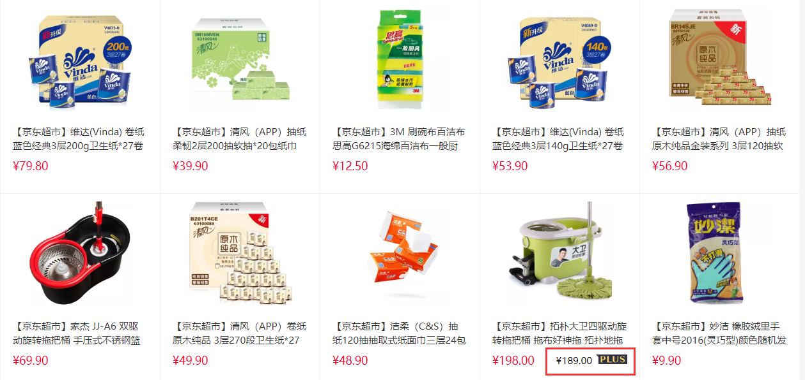


```html
 <div id="app">
        <!-- 如果isShow的值是true ,就显示p标签 -->
        <p v-if="isShow">我是p标签中的内容</p>
        <p v-show="isShow">我是p标签中的内容</p>
        <!-- 如果标签显示与隐藏切换频繁, 就使用v-show 
            v-show本质是通过修改标签的display值
        -->
    </div>
    <script src="./vue.js"></script>
    <script>
        new Vue({
            el: '#app',
            data: {
                isShow: false
            }
        });
    </script>
```

`效果` 


> `v-if` 有更高的切换开销，而 `v-show` 有更高的初始渲染开销。
>
> 因此，如果需要非常频繁地切换，则使用 `v-show` 较好；
>
> 如果在运行时条件很少改变，则使用 `v-if` 较好。 

### [v-on](https://vuefe.cn/v2/guide/events.html)

- 作用:使用 `v-on` 指令绑定 DOM 事件，并在事件被触发时执行一些 JavaScript 代码。

- 语法:  @事件名.修饰符 = "methods中的方法名"  

- 注意: $event  可以传形参

  ```html
   <div id="app">
          <!-- v-on.xx事件名='当触发xx事件时执行的语句' -->
          <!-- 执行一段js语句:可以使用data中的属性 -->
          <button v-on:click="count += 1">增加 1</button>
          <!-- v-on的简写方法 -->
          <button @click="count += 1">增加 1</button>
          <!-- 执行一个方法 -->
          <button @click="add">增加 1</button>
          <!-- 执行一个方法、这种写法可以传形参 -->
          <button @click="fn1(count)">执行fn1方法</button>
          <!-- 执行一个方法、这种写法可以传形参,特殊的形参$event -->
          <button @click="fn2($event)">执行fn2方法</button>
          <hr>
          <!-- 和v-for结合使用 -->
          <button @click="fn3(index)" v-for="(item, index) in items">执行fn3方法</button>
          <!-- v-on修饰符 如 once: 只执行一次 -->
          <button @click.once="fn4">只执行一次</button>
  
          <p>上面的按钮被点击了 {{ count }} 次。</p>
      </div>
      <script src="./vue.js"></script>
      <script>
          new Vue({
              el: '#app',
              data: {
                  count: 0,
                  items: ['a', 'b', 'c']
              },
              methods: {
                  add: function() {
                      this.count += 1;
                  },
                  fn1: function(count) {
                      console.log(count);
                      console.log('fn1方法被执行');
                  },
                  fn2: function(e) {
                      console.log(e);
                      console.log('fn2方法被执行');
                  },
                  fn3: function(index) {
                      console.log(index);
                      console.log('fn3方法被执行');
                  },
                  fn4: function() {
                      console.log('fn4方法被执行了');
                  }
              }
          });
      </script>
  ```

- 修饰符

  - `.once` - 只触发一次回调。
  - `.prevent` - 调用 `event.preventDefault()`。

> 简写: @事件名.修饰符 = 'methods中的方法名'


### [v-for](https://cn.vuejs.org/v2/guide/list.html)

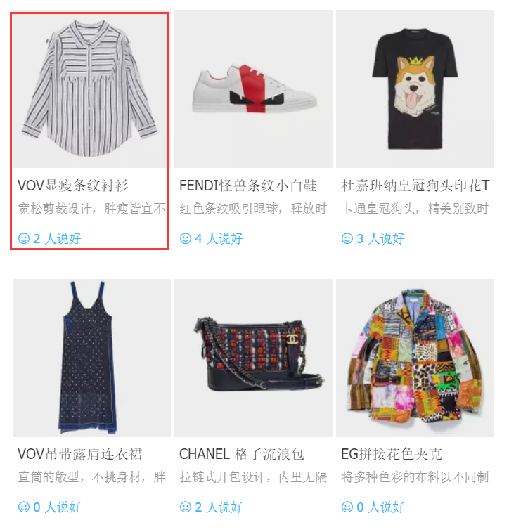

> 根据一组数组或对象的选项列表进行渲染。
>
> `v-for` 指令需要使用 `item in items` 形式的特殊语法，
>
> `items` 是源数据数组 /对象
>
> 当要渲染相似的标签结构时用v-for

```html
<!DOCTYPE html>
<html lang="en">

    <head>
        <meta charset="UTF-8">
        <meta name="viewport" content="width=device-width, initial-scale=1.0">
        <meta http-equiv="X-UA-Compatible" content="ie=edge">
        <title>Document</title>
    </head>

    <body>
        <div id="app">
            <!-- v-for作用:列表渲染,当遇到相似的标签结构时,就用v-for去渲染
				v-for="元素 in 容器(数组和对象)"
				v-for="数组中的元素 in data中的数组名"
				v-for="对象中的属性值 in data中的对象名"
			-->
            <!-- 数组 -->
            <p v-for="item in list">{{item}}</p>
            <hr>
            <p v-for="(item,index) in list">{{item}}----{{index}}</p>
            <!-- (v,i) in 数组
				v:数组中的每个元素
				i:数组中元素的下标
			-->
            <hr>
            <!-- 对象 -->
            <!-- (v,k,i)in 对象
				v:值
				k:键
				i:对象中每对key-value的索引 从0开始
				注意: v,k,i是参数名,见名知意即可!
			-->
            <p v-for="value in per">{{value}}</p>
            <hr>
            <p v-for="(value,key) in per">{{value}}----{{key}}</p>
            <hr>
            <p v-for="(value,key,i) in per">{{value}}----{{key}}--{{i}}</p>

        </div>
        <script src="./vue.js"></script>
        <script>
            new Vue({
                el: '#app',
                data: {
                    list: ['a', 'b', 'c'],
                    per: {
                        name: '老王',
                        age: 38,
                        gender: '男'
                    }
                },
                methods: {

                }
            })
        </script>
    </body>

</html>
```

> 注意: 在使用v-for时,要把一个唯一值赋值给:key属性(通常是数组的index或者数据的id)

```html

 <div id="app">

        <!-- v-for 
            key属性: 值通常是一个唯一的标识
            key是一个可选属性
            养成好习惯:建议在写v-for时 设置:key="唯一值"
        -->
        <ul>
            <li v-for="(item,index) in list" :key="index">{{item}}---{{index}}</li>
        </ul>
    </div>
    <script src="./vue.js"></script>
    <script>
        new Vue({
            el: '#app',
            data: {
                list: ['a', 'b', 'c']
            },
            methods: {

            }
        });
    </script>
```


### [v-bind](https://cn.vuejs.org/v2/guide/class-and-style.html)

**作用:** 可以绑定标签上的任何属性。

#### 绑定src和id属性

```html
  <div id="app">
        <!-- data中的属性值会替换为标签的属性值 -->
        
        <p v-bind:id="idValue">内容</p>
    </div>
    <script src="./vue.js"></script>
    <script>
        var vm = new Vue({
            el: '#app',
            data: {
                src: './logo.png',
                idValue: 'b'
            }
        });
    </script>
```
#### 绑定class类名

对象语法和数组语法

##### 对象语法

如果isActive为true，则返回的结果为 `<div class="active"></div>`

```css
 .active {
            color: red;
 }
```

```html
 <div id="app">
        <div v-bind:class="{active: isActive}">
            hei
        </div>
        <button @click="changeClassName">点击切换类名</button>
    </div>
```

```js

  <script src="./vue.js"></script>
    <script>
        var vm = new Vue({
            el: '#app',
            data: {
                isActive: true
            },
            methods: {
                changeClassName: function() {
                    this.isActive = !this.isActive;
                }
            }
        });
    </script>
```

##### 数组语法

渲染的结果 `<div class="active text-danger"></div>`

```html
<div v-bind:class="[activeClass, dangerClass]">
    hei
</div>
  <script src="./vue.js"></script>
<script>
    var vm = new Vue({
        el: '#app',
        data: {
        	activeClass: 'active',
            dangerClass: 'text-danger'
        }
    });
</script>
```
#### 绑定style

对象语法和数组语法

##### 对象语法

渲染的结果<div style="color: red; font-size: 18px;"></div>

```html
 <div id="app">
        <div v-bind:style="{color: redColor, fontSize: font18 + 'px'}">
            文本内容
        </div>
    </div>
    <script src="./vue.js"></script>
    <script>
        var vm = new Vue({
            el: '#app',
            data: {
                redColor: 'red',
                font18: 18
            }
        });
    </script>
```
##### 数组语法

```html
<div v-bind:style="[color, fontSize]">abc</div>
<script>
    var vm = new Vue({
        el: '#app',
        data: {
            color: {
                color: 'red'
            },
            fontSize: {
                'font-size': '18px'
            }
        }
    });
</script>
```
#### 简化语法

```html
<div v-bind:class="{active: isActive}">
</div>
<!-- 可以简化为 :，简化语法更常用 -->
<div :class="{active: isActive}">
</div>
```


### v-model

**作用:** 表单元素的绑定

特点: **双向数据绑定**

- 数据发生变化可以更新到界面
- 通过界面可以更改数据
- `v-model` 会忽略所有表单元素的 `value`、`checked`、`selected` 特性的初始值而总是将 Vue 实例的数据作为数据来源。应该在 `data`选项中声明初始值。 

#### 绑定文本框

**效果:**当文本框的值发生变化后，div中的内容也会发生变化

```html
 <div id="app">
        <p>{{message}}</p>
        <input type='text' v-model='message'>
        <hr>
        <!-- v-model其实是语法糖,它是下面这种写法的简写 -->
        <input v-bind:value='message' v-on:input='message = $event.target.value' />

    </div>
    <script src="./vue.js"></script>
    <script>
        var vm = new Vue({
            el: '#app',
            data: {
                message: 'message默认值'
            }
        });
    </script>
```
#### 绑定多行文本框

```html
 <div id="app">
        <textarea v-model="message">
           我是textarea内的插值表达式 无效 {{str}}
        </textarea>
        <div>{{ message }}</div>
    </div>
    <script src="./vue.js"></script>
    <script>
        var vm = new Vue({
            el: '#app',
            data: {
                message: 'message默认值',
                str: 'str字符串'
            }
        });
    </script>
```

**注意：**多行文本框中使用插值表达式 无效


#### 绑定复选框

- ##### 绑定一个复选框

> checked是布尔类型的数据

```html
<input type="checkbox" v-model="checked">
<div>{{ checked }}</div>
```

- ##### 绑定多个复选框

  此种方式需要input标签**提供value属性**

   v-model绑定的是**数组-**

```html
 <!-- 多个复选框  : 需要设置value属性值, v-model绑定的是数组-->
	<div id="app">
        <div>
            <input type="checkbox" id="jack" value="Jack" v-model="checkedNames">
            <label for="jack">Jack</label>
            <input type="checkbox" id="john" value="John" v-model="checkedNames">
            <label for="john">John</label>
            <input type="checkbox" id="mike" value="Mike" v-model="checkedNames">
            <label for="mike">Mike</label>
            <br>
            <span>Checked names: {{ checkedNames }}</span>
        </div>
    </div>
    <script src="./vue.js"></script>
    <script>
        var vm = new Vue({
            el: '#app',
            data: {
                checkedNames: []
            }
        });
    </script>
```
- ##### 绑定单选框

  > 需要input提供value属性的值

  ```html
  男<input type="radio" name="sex" value="男" v-model="sex">
  女<input type="radio" name="sex" value="女" v-model="sex">
  {{sex}}
  <script>
      var vm = new Vue({
         el: '#app',
          data: {
              sex: ''
          }
      });
  </script>
  ```

- ##### 绑定下拉框

  ```html
  <div id="app">  
  <!-- 下拉框 -->
          <select v-model="selected">
              <option disabled value="">请选择</option>
              <option>北京</option>
              <option>上海</option>
              <option>深圳</option>
          </select> <span> 您选择的是: {{selected}}</span>
  </div>
      <script src="./vue.js"></script>
      <script>
          var vm = new Vue({
              el: '#app',
              data: {
                  selected: ''
              }
          });
      </script>
  ```

### v-cloak

**问题**:在使用vue绑定数据的时候，渲染页面有时会出现变量闪烁，例如

 ```html
 <div id="app" v-cloak>
        <p>{{message}}</p>
    </div>
    <script src="https://cdn.jsdelivr.net/npm/vue@2.5.16/dist/vue.js"></script>
    <script>
        var vm = new Vue({
            el: '#app',
            data: {
                message: '我是data中message的数据'
            }
        });
    </script>
 ```

**效果:**  在页面加载时,有时会在页面中看到这个:

```web
{{message}}
```

**解决方案:** 使用v-cloak

```html
<div id="app" v-cloak>
    <p>{{message}}</p>
</div>
```

**注意:**要在css代码部分写如下代码

```css
[v-cloak] {
    display: none;
}
```

这样:就可以防止也页面闪烁


### v-once

**解决的问题:**只渲染元素和组件一次，随后的渲染，使用了此指令的元素/组件及其所有的子节点，都会当作静态内容并跳过，这可以用于优化更新性能。 

```html
 <div id="app">
        <p v-once>{{message}}</p>
        <input type="text" v-model="message">
    </div>
    <script src="./vue.js"></script>
    <script>
        var vm = new Vue({
            el: '#app',
            data: {
                message: '我是data中message的属性的值'
            }
        });
    </script>
```

> 当添加v-once的指令所对应的元素, 其数据发生改变时,并不会再一次进行渲染

> v-cloak和v-once 不需要表达式, 直接将指令写在开始标签中即可

## 案例-表格展示

- 效果演示
- 功能分析
  - 渲染表格
  - 删除商品
  - 添加商品

### 渲染表格

> 目的:动态渲染表格 数据为Vue实例中data里面的属性items:[]

1. 在data中添加商品信息的数组
2. v-for渲染列表
3. 插值表达式渲染数据

```html
<tr v-for="item in items">
                    <td>{{item.id}}</td>
                    <td>{{item.name}}</td>
                    <td>{{item.date}}</td>
                    <td><a href="#">删除</a></td>
</tr>
```

```js
 <script src="./vue.js"></script>
    <script>
        // 1. 实例化Vue对象
        // 2. 设置Vue对象的选项
        new Vue({
            el: '#app',
            data: {
                items: [{
                        name: 'LV',
                        date: '2018-8-1'
                    }, {
                        name: 'Lenovo',
                        date: '2018-8-1'
                    }, {
                        name: 'TCL',
                        date: '2018-8-1'
                    }

                ]
            },
            methods: {

            }
        })
    </script>
```

### 处理无数据时的渲染

> 效果: 如果表格中没有数据,展示页面中的"没有品牌数据"

```html
<tr v-if="items.length === 0">
    <td colspan="4">没有品牌数据</td>
</tr>
```

### 删除商品

> 效果:点击每个表格中的删除按钮, 当前数据从页面中移除

1. 绑定click事件
2. 取消默认点击事件
3. 执行删除deleItem方法
4. 将点击的a所在的tr的位置进行传递(目的是找到当前点击的tr)
5. 点击后, 删除当前tr

```html
<td>
    <!-- 点击删除按钮
1. 取消默认点击事件
2. 执行删除deleItem方法
3. 将所点击的a所在的tr的位置进行传递(目的是找到当前点击的tr)
4. 点击后, 删除当前tr
-->
    <a href="#" @click.	prevent="deleItem(index)">删除</a>
</td>
```

```js
methods: {
    deleItem: function(index) {
        console.log(index);
        this.items.splice(index, 1);
        console.log(this.items);
    }
}
```

### 添加商品

> 效果:点击添加按钮,向商品列表中添加商品信息

1. 绑定click事件
2. 在data中添加要绑定的属性name
3. v-model绑定name属性
4. 点击按钮后,将商品信息添加到items数组中

```html
<div class="add">
    品牌名称:
    <input type="text" v-model="name">
    <input type="button" value="添加" @click="addItem">
</div>
```

```js
data: {
    name: ''
},
    methods: {
        addItem: function() {
            console.log('添加按钮被点击');
            const item = {
                name: this.name,
                date: new Date()
            };
            this.items.unshift(item)
        }
    }
```

### 细节处理

1. 删除提示框

```js
deleItem: function(index) {
    // console.log(index);
    if (confirm('是否删除')) {
        this.items.splice(index, 1);
    }
    // console.log(this.items);
}
```

2. 添加的数据为空时的处理

> 如果文本框为空, 提示输入内容
>
> 如果文本框不为空,直接添加

```js
if (this.name.length === 0) {
    alert('请输入商品信息');
    return;
}
this.items.unshift(item);
```

> 当商品信息为空时,禁用添加按钮

```html
<div class="add">
    品牌名称:
    <input type="text" v-model="name">
    <input :disabled="name.length === 0" type="button" value="添加" @click="addItem">
</div>
```

> 添加数据成功后,清空文本输入框

```js
addItem: function() {
    console.log('添加按钮被点击');
    const item = {
        name: this.name,
        date: new Date()
    };
    if (this
        .name.length === 0) {
        alert('请输入商品信息');
        return;
    }
    this.items.unshift(item);
    // 添加完毕 清空文本框
    this.name = '';
}
```

## Vue其他知识点

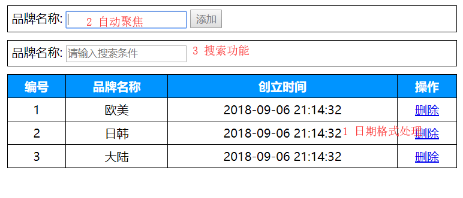

### [过滤器](https://cn.vuejs.org/v2/guide/filters.html)

- 作用:处理数据格式
- 使用位置:**双花括号插值和 v-bind 表达式** (后者从 2.1.0+ 开始支持)。
- 分类:局部注册和全局注册

#### 1. 局部注册

1. 在vm对象的选项中配置过滤器filters:{}
2. 过滤器的名字: (要过滤的数据)=>{return 过滤的结果}
3. 在视图中使用过滤器:  {{被过滤的数据 | 过滤器的名字}}

```html
<div id="app">
    <!-- 3. 调用过滤器 -->
    <p>{{ msg | upper | abc }}</p>
</div>
<script src="./vue.js"></script>
<script>
    new Vue({
        el: '#app',
        data: {
            msg: 'kfc'
        },
        // 1. 设置vm的过滤器filters选项
        filters: {
            upper: function(v) {
                // 2. 在过滤器的方法中操作数据并返回结果
                return v.toUpperCase();
            }
        }
    });
</script>
```

> 注意: 局部注册的过滤器只适用于当前vm对象

#### 2. 全局注册

1. 在创建 Vue 实例之前定义全局过滤器Vue.filter()
2. Vue.filter('该过滤器的名字',(要过滤的数据)=>{return 对数据的处理结果});
3. 在视图中通过{{数据 | 过滤器的名字}}或者v-bind使用过滤器

```html
<div id="app">
    <!-- 3. 调用过滤器: (msg会自动传入到toUpper中)-->
    <p>{{msg | toUpper}}</p>
</div>
<script src="./vue.js"></script>
<script>
    // 1. 定义全局过滤器
    Vue.filter('toUpper', (value) => {
        console.log(value);
        // 2. 操作数据并返回
        value = value.charAt(0).toUpperCase() + value.substr(1).toLowerCase();
        console.log(value);
        return value;
    });

    new Vue({
        el: '#app',
        data: {
            msg: 'hello'
        },
        methods: {

        }
    });
</script>
```

> 注意: 全局注册的过滤器, 不同的vm对象都可以使用

> 1. 过滤器是可以串联使用的, 比如 {{msg | upper1 | upper2}}
> 2. 过滤器是可以传参数的,比如{{msg | upper1(自己传的参数)}}


### ref操作DOM

- 解决的问题: 在vue中操作DOM元素
- 使用步骤:
  1. 给DOM元素设置ref属性的值
  2. 在Vue中的mounted选项下通过this.$refs.属性 获取到要操作的DOM

```html
<div id="app">
    <!-- 1. 给要操作的DOM元素设置ref属性 -->
    <input type="text" ref="txt">
</div>
<script src="./vue.js"></script>
<script>
    new Vue({
        el: '#app',
        // mounted当页面加载完毕执行
        mounted() {
            console.log(this.$refs.txt);
            // 2. 用this.$refs.属性 去操作DOM
            this.$refs.txt.focus();
        },
    });
</script>
```


### 自定义指令

- 使用场景:需要对普通 DOM 元素进行操作，这时候就会用到自定义指令 
- 分类:全局注册和局部注册

#### 1. 局部注册

1. 在vm对象的选项中设置自定义指令 directives:{}
2. directives:{'指令的核心名称':{ inserted: (使用指令时的DOM对象) => { 具体的DOM操作 } }}
3. 在视图中通过标签去使用指令

```html
<div id="app">
    <!-- 3. 在视图中通过标签去使用指令 -->
    <input v-focus type="text">
</div>

<script src="./vue.js"></script>
<script>
    var vm = new Vue({
        el: '#app',
        // 1. 在vm对象的选项中设置自定义指令 directives:{}

        directives: {
            // 2. directives:{'指令的核心名称':{ inserted: (使用指令时的DOM对象) => { 具体的DOM操作 } }}
            focus: {
                // 指令的定义
                inserted: function(el) {
                    el.focus();
                }
            }
        }
    });
</script>
```

#### 2. 全局注册

```
1. 在创建 Vue 实例之前定义全局自定义指令Vue.directive()
2. Vue.directive('指令的名称',{ inserted: (使用指令的DOM对象) => { 具体的DOM操作 } } );
3. 在视图中通过"v-自定义指令名"去使用指令
```

```html
<div id="app">
    <!-- 3. 在视图中通过标签去使用指令 -->
    <input v-focus type="text">

</div>
<script src="./vue.js"></script>
<script>
    // 全局自定义指令
    // 1.在创建 Vue 实例之前定义全局自定义指令Vue.directive()
    // 2. Vue.directive('指令的核心名称',{ inserted: (使用指令时的DOM对象) => { 具体的DOM操作 } } );
    Vue.directive('focus', {
        // 当被绑定的元素插入到 DOM 中时,inserted会被调用
        inserted: (el) => {
            // el 就是指令所在的DOM对象
            el.focus();
        }
    });

    var vm = new Vue({
        el: '#app'
    });
</script>
```

> Vue.directive(自定义指令名) 不需要加v-  使用自定义指令时需要加v-
>
> [inserted]():    当被绑定的元素插入到 DOM 中时,会被调用


### 计算属性

- 计算属性:是Vue实例的一个选项 computed:{}
- 作用:在计算属性中去处理data里的数据  
- 使用场景:任何复杂逻辑，都应当使用**计算属性**
- 本质: 计算属性的其实就是一个属性,用法和data中的属性一样,但计算属性的值是一个带有返回值的方法

```html
<div id="app">
    <p>{{a}}</p>
    <p>{{b}}</p>
    <!-- <p>{{c=a+b}}</p> -->

    <!-- 现象: data中的属性c的值依赖于data中的另外两个属性a和b
问题:如果逻辑代码很简单,可以把表达式直接写在{{}}中
如果逻辑代码很复杂, 直接把表达式写在{{}}中不合适
此时, 就用到了计算属性
-->
    <!-- 计算属性的用法和data中的属性用法一样 -->
    <p>{{comC}}</p>
    <p>{{comC}}</p>
    <p>{{comC}}</p>

</div>
<script src="./vue.js"></script>
<script>
    const vm = new Vue({
        el: '#app',
        data: {
            a: 0,
            b: 0,
            c: 0
        },
        // 计算属性
        /*
             * 计算属性是Vue实例的一个选项
             * 计算属性的值是一个对象
             * 计算属性也是属性,只不过值是带有返回值的函数
             * 当data中的属性一发生变化, 会自动调用计算属性的方法
             */
        computed: {
            comC: function() {
                return this.a + this.b
            }
        }
    });
</script>
```

### computed和methods

- computed:
  - 一旦data中的数据发生**变化**,就会触发计算属性的方法
  - 会将data中属性的结果进行缓存,对比缓存中的结果是否发生变化
- methods: 一调用就会触发, 和数据的变化与否无关

```html
<div id="app">
    <p>{{fn()}}</p>
    <p>{{fn()}}</p>
    <p>{{fn()}}</p>
    <hr>
    <p>{{comFn}}</p>
    <p>{{comFn}}</p>
    <p>{{comFn}}</p>

</div>
<script src="./vue.js"></script>
<script>
    var vm = new Vue({
        el: '#app',
        data: {
            msg: 'abc'
        },
        methods: {
            fn() {
                // 返回一个值
                console.log('fn');
                return new Date();
            }
        },
        computed: {
            comFn() {
                // 计算属性，如果data中的数据变化，会重新执行，
                console.log('计算属性');
                return new Date();
            }
        }
    });
</script>
```


## 相关工具

### [JSON-server](https://github.com/typicode/json-server)

**说明:** 可以快速把一个`json`文件托管成一个 web 服务器(提供接口)

**特点:**基于Express，支持CORS和JSONP跨域请求，支持GET, POST, PUT和 DELETE 方法

**使用:** 

```cmd
// 1 安装json-server工具(只安装一次即可)
npm i -g json-server
// 2 启动
// 创建一个目录server,在该目录下创建一个json文件，db.json
// 在server目录下执行
json-server --watch db.json
```

**验证:**

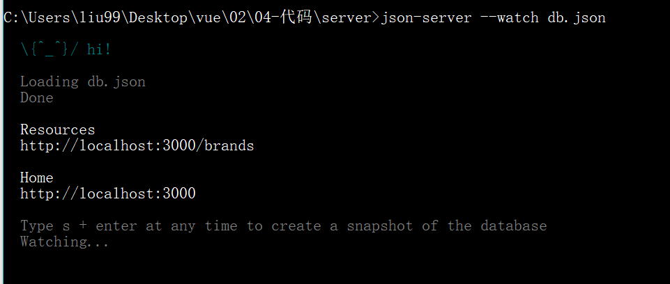

 在浏览器地址栏中输入 http://localhost:3000 发起请求、观察cmd中的变化、观察浏览器中返回的json数据

> 注意: 直接使用课程包中的db.json文件
>
> 也可以改变端口 --port


### [RESTful:接口规则](http://novoland.github.io/%E8%AE%BE%E8%AE%A1/2015/08/17/Restful%20API%20%E7%9A%84%E8%AE%BE%E8%AE%A1%E8%A7%84%E8%8C%83.html)

#### **1. 说明**

- RESTful是一套接口设计规范
- 用不同的请求类型发送同样一个请求标识 所对应的处理是不同的
- 通过Http请求的不同类型(POST/DELETE/PUT/GET)来判断是什么业务操作(CRUD ) 
- json-server应用了RESTful规范

#### **2. HTTP方法规则举例**

| **HTTP方法** | **数据处理** | **说明**                                           |
| ------------ | ------------ | -------------------------------------------------- |
| POST         | Create       | 新增一个没有id的资源                               |
| GET          | Read         | 取得一个资源                                       |
| PUT          | Update       | 更新一个资源。或新增一个含 id 资源(如果 id 不存在) |
| DELETE       | Delete       | 删除一个资源                                       |

通过标准HTTP方法对资源CRUD：

POST：创建单个资源 (资源数据在请求体中)

```
POST /brands  
```

GET：查询

```
GET /brands // 获取所有商品信息
GET /brands/1 // 获取id为1的商品信息
```

PUT：更新单个资源，客户端提供完整的更新后的资源

```
PUT /brands/1 // 更新id为1的商品信息
```

DELETE：删除

```
DELETE /brands/1  //删除id为1的商品
```

### [Postman:接口测试工具](https://www.cnblogs.com/xiaoxi-3-/p/7839278.html)

- 说明:Postman是一款功能强大的网页调试与发送网页HTTP请求的测试工具

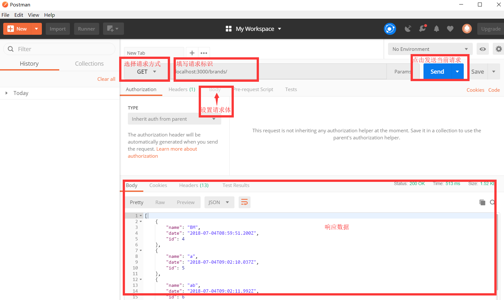


## Vue中的网络请求

在Vue.js中发送网络请求本质还是ajax，我们可以使用插件方便操作。

1. vue-resource: Vue.js的插件，已经不维护，不推荐使用
2. [axios](https://www.kancloud.cn/yunye/axios/234845) :**不是vue的插件**，可以在任何地方使用，推荐

> 说明: 既可以在浏览器端又可以在node.js中使用的发送http请求的库，支持Promise，不支持jsonp
>
> 如果遇到jsonp请求, 可以使用插件 `jsonp` 实现

- 发送get请求

  ```js
  axios.get('http://localhost:3000/brands')
      .then(res => {
      console.log(res.data);
  })
      .catch(err => {
      console.dir(err)
  });
  ```

- 发送delete请求

  ```js
  axios.delete('http://localhost:3000/brands/109')
      .then(res => {
      console.log(res.data);
  })
      .catch(err => {
      console.dir(err)
  });
  ```

- 发送post请求

  ```js
  axios.post('http://localhost:3000/brands', {name: '小米', date: new Date()})
      .then(res => {
      console.log(res);
  })
      .catch(err => {
      console.dir(err)
  });
  ```

- jsonp (如果是jsonp请求, 可以使用`jsonp` 包)

  - 安装`jsonp` 包 npm i jsonp

  ```js
  jsonp('http://localhost:3000/brands', (err, data) => {
      if (err) {
          console.dir(err.msg);
      } else {
          console.dir(data);
      }
  });
  ```

## 案例-表格展示

- 效果演示
- 功能分析
  - 日期格式处理
  - 搜索商品功能
  - 输入框自动聚焦

### 日期格式处理

> 说明:表格中的日期格式需要处理, 这里使用moment包
>
> 分析:把日期数据进行格式处理,将处理后的日期渲染到页面中->过滤器

1. 安装/引入moment包
2. 全局注册过滤器
3. 在过滤器的方法中,使用moment包对data中的日期进行处理
4. 在视图中渲染日期的位置使用过滤器

```html
<div id="app">
    <!-- 省略 -->
    <!--在视图中渲染日期的位置使用过滤器-->
    <td>{{ item.date | fmtDate('YYYY-MM-DD HH:mm:ss') }}</td>

    <!-- 省略 -->
</div>

<!-- 1 导入moment包-->
<script src="./moment.js"></script>
<script>
    // 2 定义全局过滤器
    Vue.filter('fmtDate', (v, fmtString) => {
        // 3 在过滤器的方法中,使用moment包对data中的日期进行处理
        return moment(v).format(fmtString);
    });

    var vm = new Vue({
        // ...
    });
</script>
```


### 搜索商品功能

> 说明: 在搜索输入框中输入商品名称时, 在商品列表中显示对应的商品
>
> 分析: 要渲染的视图会根据搜索内容的变化而变化-> 计算属性

1. 在data中定义属性 searchValue
2. 在搜索输入框中 v-model绑定searchValue
3. 添加计算属性:根据搜索的内容 返回搜索的结果数组 
4. 将页面中遍历items数组替换为计算属性返回的数组

```html
<div id="app">
    <!-- 省略-->
    <div class="add">
        <!--2. 在搜索输入框中 v-model绑定searchValue-->
        品牌名称:
        <input type="text" v-model="searchValue" placeholder="请输入搜索条件">
    </div>
    <!-- 省略-->
    <!-- 4 替换为计算属性-->
    <tr v-for="(item,index) in newItems">
        <!-- 省略-->
    <tr v-if="newItems.length===0">
        <td colspan="4">没有品牌数据</td>
    </tr>
</div>
<script>
    // 省略
    new Vue({
        el: '#app',
        data: {
            // 省略
            // 1. 在data中定义属性 searchValue
            searchValue: ''
        },
        // 计算属性
        computed: {
            newItems() {
                // 3. 根据搜索的内容 返回搜索的结果数组
                // filter返回满足条件的数组
                return this.items.filter((item) => {
                    // item表是数组中的每个元素
                    // 筛选item (判断item中的name的值是否以searchValue开头)
                    return item.name.startsWith(this.searchValue);
                });
            }
        },
        // 省略
    });
</script>
```


### 输入框自动聚焦

> 说明:进入页面时,添加商品的输入框自动获取焦点,等待用户输入

1. 全局自定义指令
2. 获取要操作的input,进行DOM操作
3. 在页面中使用自定义指令

```html
<div class="add">
    品牌名称:
    <!-- 3 在页面中使用自定义指令-->
    <input v-focus type="text" v-model="name">
    <input :disabled="name.length===0" @click="addItem(name)" type="button" value="添加">
</div>

<!--省略-->
<script>

    // 1 定义全局自定义指令-自动聚焦
    Vue.directive('focus', {
        // 2 当被绑定的元素插入到 DOM 中时,inserted会被调用
        inserted: (el) => {
            // el 就是指令所在的DOM对象
            el.focus();
        }
    });
</script>
```

### 在案例中使用axios

> 说明: 使用axios请求server/db.json中的数据

#### 渲染列表

1. 启动json-server
2. 安装并导入axios
3. 将items数组清空
4. 在mounted方法中发送网络请求
5. 使用返回的数据

```html
<!-- 引入axios -->
<script src="./axios.js"></script>
<script>
    new Vue({
        el: '#app',
        data: {
            items: [],
            name: '',
            searchValue: ''
        },
        // 当页面加载完毕之后执行
        mounted() {
            // 加载列表数据
            this.loadData();
        },
        methods: {
            // 加载列表数据
            loadData() {
                // 加载数据
                axios
                    .get('http://localhost:3000/brands')
                    .then((res) => {
                    this.items = res.data;
                })
                    .catch((err) => {
                    console.log(err);
                });
            },
            // 省略代码
</script>
```

#### 添加数据

> 说明:点击添加按钮时,发送post请求向db.json中增加商品数据
>
> 将addItem中的代码进行改写

```js
addItem: function(name) {
    axios
        .post('http://localhost:3000/brands', {
        name: this.name,
        date: new Date()
    })
        .then((res) => {
        // 判断响应码  201  created
        if (res.status === 201) {
            // 添加成功 重新加载列表
            this.loadData();
        } else {
            alert('添加失败');
        }
    })
        .catch((err) => {
        console.log(err);
    })
}
```

#### 删除数据

> 说明:点击删除按钮时,发送DELETE请求从db.json中删除商品数据
>
> 将deleItem中的代码进行改写

```js
deleItem: function(id) {
    // 删除提示
    if (!confirm('是否确认删除？')) {
        return;
    }
    axios
        .delete('http://127.0.0.1:3000/brands/' + id)
        .then((res) => {
        if (res.status === 200) {
            // 删除成功
            this.loadData();
        } else {
            alert('删除失败');
        }
    })
        .catch((err) => {
        console.log(err);
    })
},
```

#### 搜索商品

> 说明: 根据搜索框中的文本信息 动态发送请求获取数据
>
> 用到了watch选项: 当属性值发生变化 就执行响应的代码

```js
// 侦听器
watch: {
    // 监听的是data中的属性searchValue
    searchValue(nValue, oValue) {
        // console.log(newValue, oldValue);
        // 发送异步请求
        axios
            .get('http://127.0.0.1:3000/brands?name=' + nValue)
            .then((res) => {
            this.items = res.data;
        });
    }
}
```


## 组件基础

### 什么是组件

**需求:**如果页面中有多个一样结构的控件,比如

```html
<div id="app">
    <!-- 页面中有多个一样结构的标签: span+button -->
        <span>{{count1}}</span> <button @click="changeCount1">按钮</button> <br>
        <span>{{count2}}</span> <button @click="changeCount2">按钮</button> <br>
        <span>{{count3}}</span> <button @click="changeCount3">按钮</button> <br>
        <span>{{count4}}</span> <button @click="changeCount4">按钮</button> <br>
        <span>{{count5}}</span> <button @click="changeCount5">按钮</button> <br>
</div>
<script src="./vue.js"></script>
<script>
    new Vue({
        el: '#app',
        data: {
            count1: 0,
            count2: 0,
            count3: 0,
            count4: 0,
            count5: 0
        },
        methods: {
            changeCount1() {
                this.count1++;
            },
            changeCount2() {
                this.count2++;
            },
            changeCount3() {
                this.count3++;
            },
            changeCount4() {
                this.count4++;
            },
            changeCount5() {
                this.count5++;
            }
        }
    });
</script>
```

**问题:** 

> 1. 代码重复 冗余
> 2. 不利于维护

**解决方案:** 使用Vue中一个十分重要的特性-[**组件**](https://cn.vuejs.org/v2/guide/components.html)

`体验组件的使用` 

```html
<div id="app">
    <!-- 2. 使用组件 -->
    <span-btn></span-btn>
    <span-btn></span-btn>
    <span-btn></span-btn>
    <span-btn></span-btn>
</div>
<script src="./vue.js"></script>
<script>
    // 注册全局组件
    Vue.component('span-btn', {
        template: `
<div>
<span>{{count}}</span> 
<button @click="changeCount">按钮</button>
    </div>
`,
        data() {
            return {
                count: 0
            }
        },
        methods: {
            changeCount() {
                this.count++;
            }
        }
    });

    new Vue({
        el: '#app'
    });
</script>
```

**什么是组件:**

组件系统是 Vue 的另一个重要概念，允许我们使用小型、独立和通常**可复用**的组件构建大型应用。

仔细想想，几乎任意类型的应用界面都可以抽象为一个组件树： 

例如，你可能会有页头、侧边栏、内容区等组件，每个组件又包含了其它的像导航链接、博文之类的组件。 

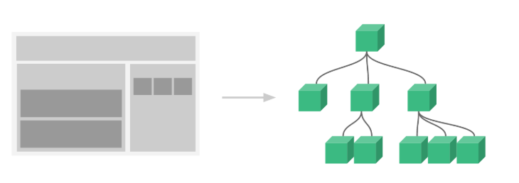

- 组件是可复用的 Vue 实例，且带有一个名字 
- 组件的选项:
  - 组件与 `new Vue` 接收相同的选项:例如 `data`、`computed`、`watch`、`methods` 以及生命周期钩子等。
  - 仅有的例外是像 `el` 这样根实例特有的选项
- 另外, 组件也有自己的选项 template components等


### 组件的特点

- 组件是一种封装 
- 组件能够让我们复用已有的html、css、js
- 可复用
- 是一个特殊的Vue实例
- 可以任意次数的复用
- 每用一次组件，就会有一个它的新**实例**被创建
- 组件中的data要求必须是一个函数,且需要返回一个对象
  - 组件有自己的作用域
- template **每个组件模板有且只有一个根元素** 

> 建议: 在实际开发中,尽可能使用各种第三方组件

### 组件的分类和使用

- **分类:**全局注册和局部注册
- **使用(步骤):**1. 注册组件  2. 通过组件名字使用组件

#### 全局注册

1. 使用Vue.component(组件名,组件选项) 进行注册

   组件名:推荐小写加减号的命名方式

2. 用在其被注册之后的任何 (通过 `new Vue`) 新创建的 (一个或者多个)Vue 实例

```js
      Vue.component('组件名', {
            // 组件选项: data methods template等(没有el)
            // data 的值是一个函数, 需要返回一个对象
      });
```

```html
<div id="app">
    <!-- 2. 使用组件 -->
    <span-btn></span-btn>
    <span-btn></span-btn>
    <span-btn></span-btn>
    <span-btn></span-btn>
</div>
<hr>
<div id="app1">
    <span-btn></span-btn>
    <My-Component></My-Component>
</div>
<hr>
<div id="app2">
    <span-btn></span-btn>

</div>
<hr>
<div id="app3">
    <span-btn></span-btn>
</div>
<script src="./vue.js"></script>
<script>
    // 1. 注册组件
    // Vue.component('组件名', {
    //     // 组件选项: data methods template等
    // });
    Vue.component('span-btn', {
        // template: 页面字符串,有且仅有一个根元素
        template: `
<div>
<span>{{count}}</span> 
<button @click="changeCount">按钮</button>
    </div>
`,
        data() {
            return {
                count: 0
            }
        },
        methods: {
            changeCount() {
                this.count++;
            }
        }
    });

    Vue.component('myComponent', {
        template: `
<div>
<h1>{{num}}</h1> 
<button @click="changeTitle">按钮</button>
    </div>
`,
        style: './style.css',
        data() {
            return {
                num: 0
            }
        },
        methods: {
            changeTitle() {
                this.num++;
            }
        }
    });

    new Vue({
        el: '#app'
    });

    new Vue({
        el: '#app1'
    });
    new Vue({
        el: '#app2'
    });
    new Vue({
        el: '#app3'
    });
</script>
```


> 注意:
>
> 1. 全局组件必须写在Vue实例创建之前，才在该根元素下面生效
> 2. 在不同的Vue实例中可以使用多个不同的全局组件
> 3. 每个组件有自己的作用域


#### 局部注册

- 直接在Vue实例里面通过 components选项进行注册
- 对于 `components` 对象中的每个属性来说，
  - 其属性名就是自定义元素的名字，其属性值就是这个组件的选项对象。 

```html
<!DOCTYPE html>
<html lang="en">

    <head>
        <meta charset="UTF-8">
        <meta name="viewport" content="width=device-width, initial-scale=1.0">
        <meta http-equiv="X-UA-Compatible" content="ie=edge">
        <title>Document</title>
    </head>

    <body>
        <div id="app">
            <!-- 2 使用组件 -->
            <com-A></com-A>
            <com-B></com-B>
            <com-C></com-C>
        </div>
        <script src="./vue.js"></script>
        <script>
            // 局部组件的选项
            const comA = {
                template: `<div>{{titleA}}</div>`,
                data() {
                    return {
                        titleA: 'comA中的data里的titleA'
                    }
                }
            };
            const comB = {
                template: `<div>{{titleB}}</div>`,
                data() {
                    return {
                        titleB: 'comB中的data里的titleB'
                    }
                }
            };

            const comC = {
                template: `<div>{{titleC}}</div>`,
                data() {
                    return {
                        titleC: 'comC中的data里的titleC'
                    }
                }
            };

            new Vue({
                el: '#app',
                // 1. 在Vue实例中设置components选项{组件名:组件选项}
                components: {
                    // 在页面中的组件名:组件选项
                    'comA': comA,
                    'comB': comB,
                    'comC': comC
                }
            });
        </script>
    </body>

</html>
```


### 组件嵌套

> 我们可以在new Vue()实例中使用自定义组件,
>
> 也可以在注册自定义组件时,嵌套另一个自定义组件,也就是父子组件的关系

#### 父子组件-写法一

```html
<div id="app">
    <!-- 2. 通过组件名使用组件 -->
    <parent-Com></parent-Com>
</div>
<script src="./vue.js"></script>
<script>
    // 1. 注册全局组件
    Vue.component('childCom', {
        template: `
<div>
<h1>childCom全局组件</h1>
    </div>
`
    });

    Vue.component('parentCom', {
        // 在parentCom中嵌入childCom组件
        // parentCom和childCom属于父子组件
        // 父组件是parentCom
        // 子组件是childCom
        template: `
<div>
<h1>parentCom全局组件</h1>
<child-Com></child-Com>
    </div>
`
    });

    new Vue({
        el: '#app'
    });
</script>
```

#### 父子组件-写法二

```html
<div id="app">
    <!-- 2. 通过组件名使用组件 -->
    <parent-Com></parent-Com>
</div>
<script src="./vue.js"></script>
<script>
    // 1. 局部组件的选项
    const childCom = {
        template: `
<div>
<h1>childCom局部组件</h1>
    </div>
`
    };

    // 在parentCom组件选项中 使用components选项设置其子组件
    // 在template中使用该子组件
    const parentCom = {
        template: `
<div>
<h1>parentCom局部组件</h1>
<child-Com></child-Com>
    </div>
`,
        components: {
            'childCom': childCom
        }
    };

    new Vue({
        el: '#app',
        components: {
            'parentCom': parentCom
        }
    });
</script>
```


## 组件通信

> 父->子(在子组件中使用父组件数据)  props : 不可修改 单向数据传递
>
> 子->父(在父组件中使用子组件数据) 自定义事件!
>
> 兄弟组件
>
> 

> 组件让我们提高了代码的复用性,接下来考虑如何在不同的组件中进行传值
>
> 比如: 父组件有items数组 在子组件中使用父组件中的items数组去渲染列表

### 父子组件通信

> 目的: 要在子组件中使用父组件中data中的属性值
>
> 关键点:通过Props给子组件传值
>
> 步骤:
>
> 1. 在子组件中通过props声明自定义属性title
> 2. 注册局部组件
> 3. 使用子组件时,设置props选项, 通过自定义属性获取父组件的值

```html
<div id="app">
    <!-- 3. 使用子组件时,通过动态绑定自定义属性获取父组件的值 -->
    <component-a :title="msg" :lists="items"></component-a>
</div>

<script src="./vue.js"></script>
<script>
    var ComponentA = {
        // 1. 在子组件中通过props声明自定义属性title
        template: `<div>
<h1>{{ title }}</h1>
<ul>
<li  v-for="item in lists">
{{item.name}}
    </li>
    </ul> 
    </div>`,
        // 用来接收外部传过来的数据
        // 值的传递是单向的，内部不要修改props里变量的值
        props: ['title', 'lists']
    };

    new Vue({
        el: '#app',
        // 目的: 要在子组件中使用父组件的msg的值
        data: {
            msg: 'hello heima',
            items: [{
                'id': 1,
                'name': '小狗'
            }, {
                'id': 2,
                'name': '小猫'
            }, {
                'id': 3,
                'name': '小羊'
            }

                   ]
        },
        // 2. 注册局部组件
        components: {
            'component-a': ComponentA
        }
    });
</script>
```

> 父子组件的传值有多种方法, 兄弟组件的通信也有自己的写法
>
> 避免混淆,这里我们先只讲父子组件通信的一种写法
>
> 会在后续的案例中会进行讲解


## 组件和模块

- 模块：侧重于功能或者数据的封装。具有独立功能
- 组件：包含了 template、style 和 script，而它的 script 可以由各种模块组成

在Vue中，.js文件可以看做是一个模块，其可以是组件的一部分。

因为通常在写.vue组件时，会导入js文件，如require('./add.js'),该步骤可以理解为导入一个模块

图示：


## [钩子函数](https://cn.vuejs.org/v2/api/#%E9%80%89%E9%A1%B9-%E7%94%9F%E5%91%BD%E5%91%A8%E6%9C%9F%E9%92%A9%E5%AD%90)

> 生命周期是指Vue实例或者组件从诞生到消亡经历的每一个阶段，在这些阶段的前后可以设置一些函数当做事件来调用。


```js
<body>
  <div id="app">
    <h1>{{message}}</h1>
  </div>
</body>

<script>
  var vm = new Vue({
    el: '#app',
    data: {
      message: 'Vue的生命周期'
    },
    beforeCreate: function() {
      console.group('------beforeCreate创建前状态------');
      console.log("%c%s", "color:red" , "el     : " + this.$el); //undefined
      console.log("%c%s", "color:red","data   : " + this.$data); //undefined 
      console.log("%c%s", "color:red","message: " + this.message) 
    },
    created: function() {
      console.group('------created创建完毕状态------');
      console.log("%c%s", "color:red","el     : " + this.$el); //undefined
      console.log("%c%s", "color:red","data   : " + this.$data); //已被初始化 
      console.log("%c%s", "color:red","message: " + this.message); //已被初始化
    },
    beforeMount: function() {
      console.group('------beforeMount挂载前状态------');
      console.log("%c%s", "color:red","el     : " + (this.$el)); //已被初始化
      console.log(this.$el);
      console.log("%c%s", "color:red","data   : " + this.$data); //已被初始化  
      console.log("%c%s", "color:red","message: " + this.message); //已被初始化  
    },
    mounted: function() {
      console.group('------mounted 挂载结束状态------');
      console.log("%c%s", "color:red","el     : " + this.$el); //已被初始化
      console.log(this.$el);    
      console.log("%c%s", "color:red","data   : " + this.$data); //已被初始化
      console.log("%c%s", "color:red","message: " + this.message); //已被初始化 
    },
    beforeUpdate: function () {
      console.group('beforeUpdate 更新前状态===============》');
      console.log("%c%s", "color:red","el     : " + this.$el);
      console.log(this.$el);   
      console.log("%c%s", "color:red","data   : " + this.$data); 
      console.log("%c%s", "color:red","message: " + this.message); 
    },
    updated: function () {
      console.group('updated 更新完成状态===============》');
      console.log("%c%s", "color:red","el     : " + this.$el);
      console.log(this.$el); 
      console.log("%c%s", "color:red","data   : " + this.$data); 
      console.log("%c%s", "color:red","message: " + this.message); 
    },
    beforeDestroy: function () {
      console.group('beforeDestroy 销毁前状态===============》');
      console.log("%c%s", "color:red","el     : " + this.$el);
      console.log(this.$el);    
      console.log("%c%s", "color:red","data   : " + this.$data); 
      console.log("%c%s", "color:red","message: " + this.message); 
    },
    destroyed: function () {
      console.group('destroyed 销毁完成状态===============》');
      console.log("%c%s", "color:red","el     : " + this.$el);
      console.log(this.$el);  
      console.log("%c%s", "color:red","data   : " + this.$data); 
      console.log("%c%s", "color:red","message: " + this.message)
    }
  })
</script>
</html>
```

## 前端路由

### 什么是单页应用

**单页应用**(single page web application，**SPA**)，是在一个页面完成所有的业务功能，浏览器一开始会加载必需的HTML、CSS和JavaScript，之后所有的操作都在这张页面完成，这一切都由JavaScript来控制。

### 单页应用优缺点

- 优点
  - **操作体验流畅**
  - **完全的前端组件化**
- 缺点
  - **首次加载大量资源**(可以只加载所需部分)
  - **对搜索引擎SEO不友好** -> 服务端渲染
  - **开发难度相对较高**

### 单页应用的实现原理

> 前后端分离(后端专注于数据、前端专注于交互和可视化)+前端路由

- Hash路由

  - 利用URL上的hash，当hash改变不会引起页面刷新，所以可以利用 hash 值来做单页面应用的路由，

    并且当 url 的 hash 发生变化的时候，可以触发相应 hashchange 回调函数。

  - 模拟实现:

  ```js
  <a href="#/">首页</a>
  <a href="#/users">用户管理</a>
  <a href="#/rights">权限管理</a>
  <a href="#/goods">商品管理</a>
  <div id="box">
      </div>
  <script>
      var box = document.getElementById('box');
  window.onhashchange = function() {
      // #/users
      var hash = location.hash;
      hash = hash.replace('#', '');
      switch (hash) {
          case '/':
              box.innerHTML = '这是首页';
              break;
          case '/users':
              box.innerHTML = '这是用户管理';
              break;
          case '/rights':
              box.innerHTML = '这是权限管理';
              break;
      }
  };
  </script>
  ```

- History路由

  - History 路由是基于 HTML5 规范，在 HTML5 规范中提供了 *history.pushState || history.replaceState* 来进行路由控制

  

## [vue-router](https://router.vuejs.org/zh/)

> Vue-Router 是 [Vue.js](http://cn.vuejs.org/) 官方的路由管理器。它和 Vue.js 的核心深度集成，让构建单页面应用变得易如反掌 
>
> 实现根据不同的请求地址 而显示不同的组件

### 快速体验

1. 导入vue和vue-router

2. 设置HTML中的内容

   ```html
   <!-- router-link 最终会被渲染成a标签，to指定路由的跳转地址 -->
   <router-link to="/users">用户管理</router-link>
   
   <!-- 路由匹配到的组件将渲染在这里 -->
   <router-view></router-view>
   ```

3. 创建组件

   ```js
   // 创建组件
   // 组件也可以放到单独的js文件中
   var Home = {
       template: '<div>这是Home内容</div>'
   };
   var Users = {
       template: '<div>这是用户管理内容</div>'
   };
   ```

4. 配置路由规则

   ```js
   // 配置路由规则
   var router = new VueRouter({
       routes: [
           { name: 'home', path: '/', component: Home },
           { name: 'users', path: '/users', component: Users }
       ]
   });
   ```

5. 设置vue的路由选项

   ```js
   var vm = new Vue({
       el: '#app',
       router
   });
   ```

### 动态路由

场景: 不同的path对应同一个组件

注意: 变化的路由 改成 :参数

此时可以通过路由传参来实现，具体步骤如下：

1. 路由规则中增加参数，在path最后增加 **:id**

   ```js
   { name: 'users', path: '/users/:id', component: Users },
   ```

2. 通过 <router-link> 传参，在路径上传入具体的值

   ```html
   <router-link to="/users/120">用户管理</router-link>
   ```

3. 在组件内部可以使用，**this.$route** 获取当前路由对象

   ```js
   var Users = {
       template: '<div>这是用户管理内容 {{ $route.params.id }}</div>',
       mounted() {
           console.log(this.$route.params.id);
       }
   };
   ```


### 路由嵌套

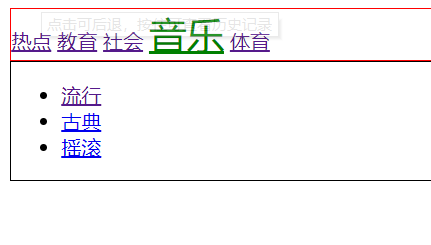

> 如果存在组件嵌套,就需要提供多个视图容器<router-view></router-view>
>
> 同时,router-link和router-view 都可以添加类名、设定样式

```html
<div id="app">
    <!--router-link运行后会自动变成a标签-->
    <nav>
        <router-link to="/top">热点</router-link>
        <router-link to="/tech">教育</router-link>
        <router-link to="/soc">社会</router-link>
        <router-link to="/mus">音乐</router-link>
        <router-link to="/te">体育</router-link>
    </nav>

    <!--容器-->
    <router-view class="box">
    </router-view>
</div>

<script src="./vue.js"></script>
<script src="./vue-router.js"></script>
<script>
    // 组件:

    // 热点
    var Top = {
        template: '<h1>Top</h1>'
    };

    // 体育:带参数的二级路由
    var Te = {
        template: `
<div>
<ul>
<li><router-link to='/te/basb/10'>篮球</router-link></li>
<li><router-link to='/te/fotb/10'>足球</router-link></li>
<li><router-link to='/te/mbal/10'>好多球</router-link></li>
    </ul>
<router-view class="box"></router-view>
    </div>
`
    };

    // 教育:使用了data
    var Tech = {
        data: function() {
            return {
                name: "luck",
                age: 10,
                fn: function() {
                    alert(1);
                }
            }
        },
        template: `
<div>
<p @click="fn">{{name}}</p>
<p>{{age}}</p>
    </div>
`
    }

    // 社会
    var Soc = {
        template: '<h1>soc</h1>'
    };


    // 音乐:不带参数的二级路由
    var Mus = {
        // template: '<h1>mus</h1>'
        template: `
<div>
<ul>
<li><router-link to='/mus/pop'>流行</router-link></li>
<li><router-link to='/mus/tra'>古典</router-link></li>
<li><router-link to='/mus/roc'>摇滚</router-link></li>
    </ul>
<router-view class="box"></router-view>
    </div>
`
    };

    // 音乐:二级路由的视图
    var Pop = {
        template: '<h3>mus下的pop模块</h3>'
    };

    // 体育:二级路由的视图
    var Ball = {
        //路由参数 $route.params
        template: "<h3>{{$route.params}}</h3>"
    };

    // 配置路由
    var routes = [
        // 热点
        {
            path: '/top',
            component: Top
        },
        // 教育
        {
            path: '/tech',
            component: Tech
        },
        // 社会
        {
            path: '/soc',
            component: Soc
        }, {
            path: '/mus',
            component: Mus,
            //子路由配置
            children: [{
                path: 'pop',
                component: Pop,
            }]
        },
        // 体育
        {
            path: '/te',
            component: Te,
            children: [{ // /te/形参/10
                path: ':cate/10',
                component: Ball
            }]
        },

        //重定向:默认或者404界面 
        {
            path: '*',
            redirect: '/top'
        }
    ];

    // 实例化路由
    var router = new VueRouter({
        // routes : routes
        routes
    });

    // 实例化vue
    var vue = new Vue({
        el: '#app',
        // router : router
        router
    });
</script>
```


## [过渡和动画](https://cn.vuejs.org/v2/guide/transitions.html)

> 基本用法就是给我们需要动画的标签外面嵌套transition标签 ,并且设置name属性
>
> Vue 在插入、更新或者移除 DOM 时，提供多种不同方式的应用过渡效果。
>
> - 在 CSS 过渡和动画中自动应用 class
> - 可以配合使用第三方 CSS 动画库，如 Animate.css

### 在 CSS 过渡和动画中自动应用 class

Vue 提供了 `transition` 的封装组件，在下列情形中，可以给任何元素和组件添加进入/离开过渡

```js
// v要替换成transition组件的name属性值
v-enter：定义进入过渡的开始状态。
v-enter-active：定义进入过渡生效时的状态。
v-enter-to: 2.1.8版及以上 定义进入过渡的结束状态。
v-leave: 定义离开过渡的开始状态。
v-leave-active：定义离开过渡生效时的状态。
v-leave-to: 2.1.8版及以上 定义离开过渡的结束状态。
```

**示例：**

```html
<style>
    .box {
        position: absolute;
        left: 0;
        top: 50px;
        width: 100px;
        height: 100px;
        background-color: red;
    }
    .slide-enter, .slide-leave-to {
        left: 200px;
        opacity: 0;
    }
    .slide-enter-active, .slide-leave-active {
        transition: all 2s;
    }
    .slide-enter-to, .slide-leave {
        left: 0px;
        opacity: 1;
    }
</style>
<button @click="isShow = !isShow">显示/隐藏</button>

<transition name="slide"> 
    <div v-show="isShow" class="box"></div>
</transition>
<script>
    var vm = new Vue({
        el: '#app',
        data: {
            isShow: true
        }
    });
</script>
```

### 自定义过渡动画的类名

可以通过transition组件自定义过渡动画的类名，可以方便结合第三方的动画库使用，比如：[animate.css](https://github.com/daneden/animate.css)

```js
// transition组件的属性 
enter-class
    enter-active-class
        enter-to-class (2.1.8+)
leave-class
    leave-active-class
        leave-to-class (2.1.8+)
```

**示例：**

```html
<button @click="isShow = !isShow">toggle</button>
<transition 
            enter-active-class="animated fadeIn"
            leave-active-class="animated fadeOut">
    <div v-show="isShow">hello</div>
</transition>
<script>
    var vm = new Vue({
        el: '#app',
        data: {
            isShow: true
        }
    });
</script>
```

## [vue-cli](https://cli.vuejs.org/zh/)(脚手架)

### 为什么要用vue-cli

> 可以快速创建vue项目结构,而不需要我们一点点的去创建/管理项目所需要的各种文件夹/文件

### 什么是vue-cli

> vue-cli是npm包

```cmd
vue-cli 提供一个官方命令行工具，可用于快速搭建大型单页应用。
```

### 使用vue-cli

```cmd
# 安装 Vue CLI 脚手架
# 如果已经安装过则不需要
# 这里安装的是最新版本 3版本
npm install -g @vue/cli

# 执行vue --verson查看是否安装成功，
# 显示vue的版本，就是安装成功了
vue -V

# 如果仍然要使用vue-cli 2版本的指令 需要安装一个桥接工具
npm install -g @vue/cli-init

# 使用脚手架工具初始化你的项目
# webpack-simple是一种工程模板
vue init webpack-simple 项目名称

# 进入你初始化好的项目
cd 项目路径

# 安装项目模板所需要的依赖
npm i

# 启动开发模式
# 或者 npm start
npm run dev
```

运行npm run dev后,会在浏览器中看到如下效果:

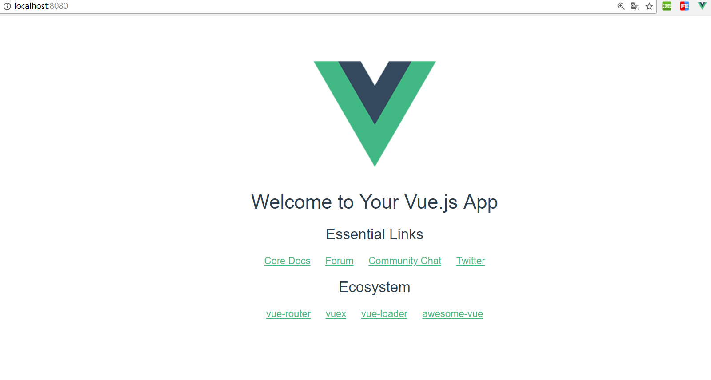

### 项目目录说明

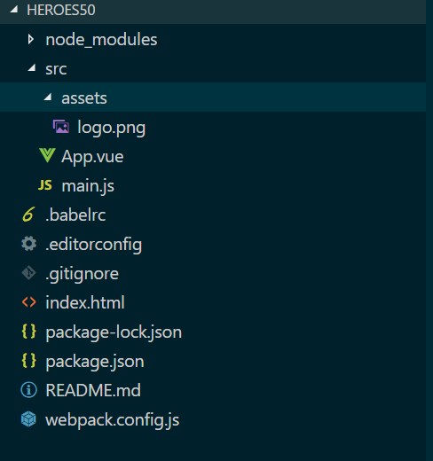

- node_modules 项目依赖包
- **src 项目核心文件(项目核心代码都放在这个文件夹下)!!!**
- assets 静态资源(样式类文件,如css、less、sass以及外部的js文件)
- App.vue 根组件,所有页面都是在App.vue下进行切换的
- 也可以理解为所有的路由也是App.vue的子组件
- main.js 入口文件:主要作用是初始化vue实例并使用需要的插件。 
- .babelrc  babel配置参数
- .editorconfig 代码格式
- .gitignore git忽略文件
- index.html 项目的首页
- package-lock.json
- package.json
- README.md 项目说明
- webpack.config.js webpack配置文件

> 注意:
>
> 一个vue页面通常由三部分组成:模板(template)、js(script)、样式(style)
>
>  我们关心的重点是src中的文件夹

### [单文件组件](https://cn.vuejs.org/v2/guide/single-file-components.html)

> 说明: 
>
> 1. *.vue 文件，是一个自定义的文件类型，用类似HTML的语法描述一个Vue组件。
> 2. 每个.vue文件包含三种类型的顶级语言块 `<template>`, `<script>` 和 `<style>`。
> 3. 这三个部分分别代表了 html,js,css。 

#### **template 部分**

- 代表它的 html 结构 
- 必须在里面放置一个 html 标签来包裹所有的代码 
- 我们在其他地方写好了一个组件，然后就可以在当前template中引入

#### **script 部分**

```js
export default {
    // 这里写你的代码,如
    el:,
    data:,
    props:
    // 省略
};
```

#### **style 部分**

 就是针对我们的 template 里内容出现的 html 元素写一些样式 

> 注意: vue-cli的作用就是让我们把精力放在业务编码上,一切准备的工作交给vue-cli去做
>
> 之后我们可以直接使用vue-cli去做案例或者项目


# Vue案例

> 讲完了Vue基础知识和vue-cli工具
>
> 我们利用所讲知识完成一个简单的案例--英雄列表
>
> 目的:
>
> 1. 熟悉vue-router的使用
> 2. 熟悉单文件组件的使用
> 3. 熟悉vue-cli的使用

## 案例演示

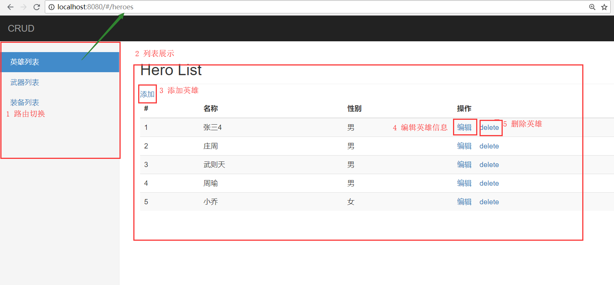

## 功能拆分

1. vue-cli创建项目hero
2. 路由配置
3. 英雄列表
   - 列表展示
   - 添加英雄
   - 编辑英雄
   - 删除英雄

## 项目起步

> 利用脚手架vue-cli生成项目结构

```cmd
# 安装 Vue CLI 脚手架
# 如果已经安装过则不需要!
npm i -g @vue/cli

# 使用脚手架工具初始化你的项目
vue init webpack-simple 项目名称

# 进入你初始化好的项目
cd 项目路径

#安装项目所需依赖
npm i

# 启动开发模式
# 或者 npm start
npm run dev
```

## 调整模板

> 将vue-cli生成的文件中无用的代码进行删除

## 首页展示

### 步骤分析:

1. 导入素材: 将课程包中index.html的标签结构放在App.vue的template中
2. 安装bootstrap@3.3.7: index.html使用了bootstrap和index.css,在vue项目中安装和导入
3. 在main.js中引入bootstrap和index.css
4. 修改webpack配置: 程序报错、无法识别字体文件, 需要在webpack.config.js中进行配置

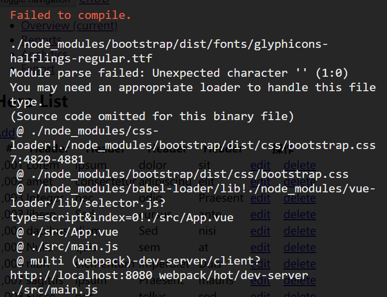

### 代码演示

#### 1. 导入素材

#### 2. 安装bootstrap,导入index.css

1. npm i bootstrap@3.3.7
2. 将课程包中的css文件夹放在assets中

#### 3. 引入bootstrap和index.css

`main.js` 

```js
import Vue from 'vue'
import App from './App.vue'

import "../node_modules/bootstrap/dist/css/bootstrap.css";
import "./assets/css/index.css";

new Vue({
    el: '#app',
    render: h => h(App)
})
```

#### 4. 修改webpack.config.js配置

```js
{
    test: /.(ttf|woff2|woff|eot)$/,
        loader: 'file-loader',
            options: {
                name: '[name].[ext]?[hash]'
            }
}
```

接下来我们用**单文件组件**的方式将页面文件提取为不同的组件

## 提取公共头部组件

### 步骤分析:

#### 1. 新建AppHeader.vue

#### 2. 修改App.vue的template

#### 3.  使用AppHeader.vue

### 代码演示:

1. 在src下新建components/AppHeader.vue
2. 找到头部的标签结构,将其放置于AppHeader.vue的template中

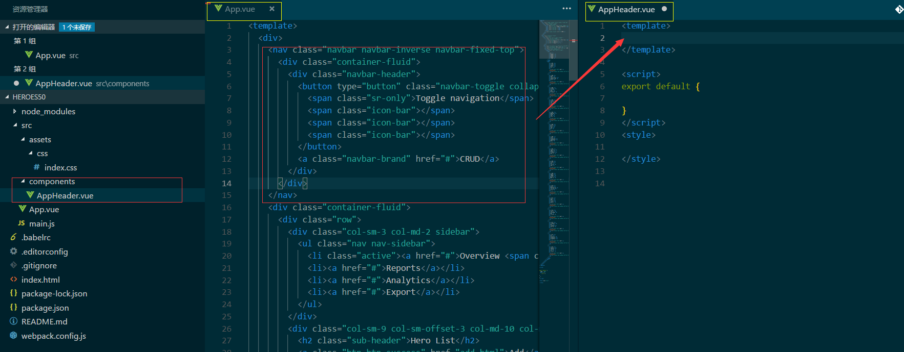

1. 在App.vue中引入并使用AppHeader.vue组件
   1. 引入AppHeader.vue组件
   2. 注册AppHeader.vue组件
   3. 使用AppHeader.vue组件

`AppHeader.vue` 

```js
<template>
    <nav class="navbar navbar-inverse navbar-fixed-top">
        <div class="container-fluid">
            <div class="navbar-header">
                <button type="button" class="navbar-toggle collapsed" data-toggle="collapse" data-target="#navbar" aria-expanded="false" aria-controls="navbar">
                    <span class="sr-only">Toggle navigation</span>
<span class="icon-bar"></span>
<span class="icon-bar"></span>
<span class="icon-bar"></span>
</button>
<a class="navbar-brand" href="#">CRUD</a>
</div>
</div>
</nav>
</template>

<script>
    export default {

}
</script>
<style>

</style>
```

`App.vue` 

```js
<template>
    <div>
    <!-- 3 使用AppHeader.vue组件 -->
<AppHeader></AppHeader>
<!--后面的标签结构 省略..-->
</div>
</template>

<script>

    // 1. 导入AppHeader.vue组件
    import AppHeader from './components/AppHeader';


export default {
    name: 'app',
    data () {
        return {

        }
    },
    // 2. 注册AppHeader组件
    components:{
        // 注意命名
        AppHeader:AppHeader
    }
}
</script>

<style lang="scss">

    </style>
```

## 提取侧边栏组件

### 步骤分析

#### 1. 新建AppSilder.vue

#### 2. 修改App.vue的template

#### 3.  使用AppSilder.vue

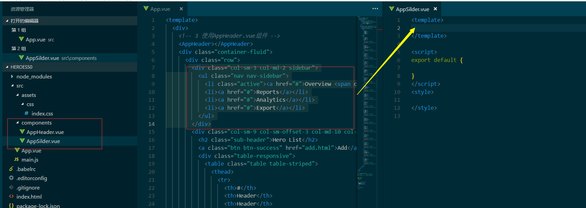

## 提取英雄列表组件

> 新建AppList.vue,并将App.vue中的英雄列表的页面标签提取到AppList.vue中

### 步骤分析

#### 1. 新建AppList.vue

#### 2. 修改App.vue的template

#### 3.  使用AppList.vue


## Vue-Router使用

> 使用 Vue-Router 实现页面导航管理

### 步骤分析及代码演示

1. 安装路由模块

```cmd
npm i vue-router
```

1. 在 `main.js` 中加载

```js
...
import VueRouter from 'vue-router' // 加载路由模块

// 注册到 Vue 中才可以使用
Vue.use(VueRouter)

// ...
```

1. 在 `main.js` 中 `new` 出 `VueRouter` 实例，并挂载到根实例的 `router` 选项中

```js
// ...

// 配置路由表
const appRouter = new VueRouter({
    routes: [
    ]
})

// ...

new Vue({
    el: '#app',
    render: h => h(App),
    // 配置实例选项 router 为你在上面 new 出来的 VueRouter 实例对象
    router: appRouter
});
```

1. 配置路由表

```js
// ...
// 配置路由表
const appRouter = new VueRouter({
    // routes 选项用来配置路由表
    // 当请求 /xxx 的时候，渲染 xxx 组件
    // routes 是一个数组，数组中存储一些固定格式的对象
    // 对象 path 表示请求的路径
    // 对象的 component 用来指定当你请求 path 路径的时候，渲染该组件
    // 现在的问题是？匹配到 path 的时候，组件往哪里渲染？
    // 在你的根组件预留一个路由的出口，用来告诉路由到匹配到某个 path 的时候，把该组件渲染到哪里
    routes: [
        {
            path: '/foo',
            component: {
                template: `<div>foo 组件啊</div>`
            }
        },
        {
            path: '/bar',
            component: {
                template: `<div>bar 组件啊</div>`
            }
        }
    ]
});
// ...
```

1. 在 `src/App.vue` 组件中设置路由出口（告诉路由往哪里渲染 path 匹配到的组件）

```html
<template>
    <div id="app">
        <AppHeader></AppHeader>
        <div class="container-fluid">
            <div class="row">
                <AppSidebar></AppSidebar>
                <div class="col-sm-9 col-sm-offset-3 col-md-10 col-md-offset-2 main">
                    <!-- <AppList></AppList> -->
                    <!--
<router-view></router-view> 组件标签是给路由看的，默认啥都没有
它不是固定的，它标识路由出口标记
当路由匹配到 path xxx 的时候，会将 router-view 替换到我们在路由表中配置好的组件
-->
                    <router-view></router-view>
                </div>
            </div>
        </div>
    </div>
</template>
```

1. 在侧边栏 `src/components/AppSidebar.vue` 组件中 增加两个导航链接用来导航 `foo` 和 `bar`

```html
<template>
    <div class="col-sm-3 col-md-2 sidebar">
        <ul class="nav nav-sidebar">
            <li class="active"><a href="#">英雄管理 <span class="sr-only">(current)</span></a></li>
            <li><a href="#">用户管理</a></li>
            <li><a href="#">商品管理</a></li>
            <li><a href="#">订单管理</a></li>
            <!--
导航链接要以 # 开头，后面跟你在路由表中配好的 path 路径
-->
            <li><a href="#/foo">Go Foo</a></li>
            <li><a href="#/bar">Go Bar</a></li>
        </ul>
    </div>
</template>

<script></script>

<style></style>
```

## 将路由导航到 .vue 组件

 `src/components/Foo.vue`:

```html
<template>
    <div>
        Foo 组件
    </div>
</template>

<script></script>
<style></style>
```

`src/components/Bar.vue`:

```html
<template>
    <div>
        Bar 组件
    </div>
</template>

<script></script>
<style></style>
```

`src/main.js`:

```js
// ...
// ...
import Foo from './components/Foo'
import Bar from './components/Bar'
import HeroList from './components/HeroList'

// ...
// ...

// 配置路由表
const appRouter = new VueRouter({
    routes: [
        {
            path: '/foo',
            component: Foo
            // component: {
            //   template: `<div>foo 组件啊</div>`
            // }
        },
        {
            path: '/bar',
            component: Bar
        },
        {
            path: '/heroes',
            component: HeroList
        }
    ]
});

// ...
```

## 提取路由模块router.js

> 将main.js中路由相关的代码提取到router.js中

`新建router.js` 

```js
import Vue from 'vue';

// 1. 导入路由
import VueRouter from 'vue-router';

// 导入组件
import AppList from './components/AppList.vue';
import Bar from './components/Bar.vue';
import Foo from './components/Foo.vue';


// 注册插件
// https://cn.vuejs.org/v2/guide/plugins.html
Vue.use(VueRouter);

// 2. 创建路由对象，配置路由规则
const router = new VueRouter({
    routes: [
        // { name: 'home', path: '/', redirect: '/heroes' },
        { name: 'home', path: '/', redirect: { name: 'heroes' } },
        // 路由规则
        { name: 'heroes', path: '/heroes', component: AppList },
        { name: 'bar', path: '/bar', component: Bar },
        { name: 'foo', path: '/foo', component: Foo }
    ]
});

// 3 导出模块
export default router;
```

`main.js` 

```js
import Vue from 'vue'
import App from './App.vue'

// import Foo from './components/Foo'
// import Bar from './components/Bar'
// import AppList from './components/AppList'

// import VueRouter from 'vue-router' // 加载路由模块
// // 注册到 Vue 中才可以使用
// Vue.use(VueRouter);

// 1 导入路由对象
import router from './router';

import "../node_modules/bootstrap/dist/css/bootstrap.css";
import "./assets/css/index.css";


new Vue({
    el: '#app',
    render: h => h(App),
    // 配置实例选项 router 为你在上面 new 出来的 VueRouter 实例对象
    // router: appRouter
    router
});
```

## 配置导航菜单

> 将AppSilder.vue中的a标签改成router-link

`AppSilder.vue` 

```js
<template>
    <div class="col-sm-3 col-md-2 sidebar">
        <ul class="nav nav-sidebar">
            <!-- <li class="active"><a href="#">Overview <span class="sr-only">(current)</span></a></li>
<li><a href="#/heroes">Reports</a></li>
    <li><a href="#">Analytics</a></li>
        <li><a href="#">Export</a></li>
            <li><a href="#/foo">Go Foo</a></li>
                <li><a href="#/bar">Go Bar</a></li> -->
                    <router-link tag="li" to="/heroes">
                        <a>英雄列表</a>
</router-link>
<router-link tag="li" to="/bar">
    <a>武器列表</a>
</router-link>
<router-link tag="li" to="/foo">
    <a>装备列表</a>
</router-link>
</ul>
</div>
</template>

<script>
    export default {

}
</script>
<style>

</style>
```

## API-Server

> 接下来要实现具体的功能, 首先是英雄列表展示,其中的数据要来源于服务器
>
> 我们使用json-server快速启动api服务器 监听课程包中的db.json
>
> 可以使用postman测试接口

## 英雄列表数据渲染

> 利用axios发送请求获取英雄列表的数据渲染到AppList.vue的template中

### 步骤分析:

1. 启动json-server
2. 在安装并在AppList.vue中导入axios
3. 在data选项中添加属性list:[]
4. 将发送请求的方法写在methods中 loadData
5. 在created钩子函数中调用loadData方法
6. 将list中的数据渲染到template中的相应位置

### 代码演示:

`AppList.vue` 

```html
<template>
    <div>
        <h2 class="sub-header">Hero List</h2>
        <a class="btn btn-success" href="add.html">Add</a>
        <div class="table-responsive">
            <table class="table table-striped">
                <!-- <thead>
<tr>
<th>#</th>
<th>Header</th>
<th>Header</th>
<th>Header</th>
<th>Header</th>
<th>操作</th>
</tr>
</thead>
<tbody>
<tr>
<td>1,001</td>
<td>Lorem</td>
<td>ipsum</td>
<td>dolor</td>
<td>sit</td>
<td>
<a href="edit.html">edit</a>
&nbsp;&nbsp;
<a href="javascript:window.confirm('Are you sure?')">delete</a>
</td>
</tr>
</tbody> -->
                <thead>
                    <tr>
                        <th>#</th>
                        <th>名称</th>
                        <th>性别</th>
                        <th>操作</th>
                    </tr>
                </thead>
                <tbody>
                    <tr :key="item.id" v-for="(item, index) in list">
                        <td>{{ index + 1 }}</td>
                        <td>{{ item.name }}</td>
                        <td>{{ item.gender }}</td>
                        <td>

                            <a href="edit.html">edit</a>
                            &nbsp;&nbsp;
                            <a href="javascript:window.confirm('Are you sure?')">delete</a>            </td>
                    </tr>
                </tbody>
            </table>
        </div>
    </div>
</template>

<script>
    import axios from 'axios';

    export default {
        data(){
            return {
                list:[]
            }
        },
        created(){
            this.loadData();
        },
        methods:{
            loadData(){
                axios.get('http://localhost:3000/users')
                    .then((res)=>{
                    console.log(res);
                    const {status,data} = res;
                    if (status == 200) {
                        this.list = data;
                    }

                })
            }
        }
    }
</script>
<style>

</style>

```

### 实现效果:

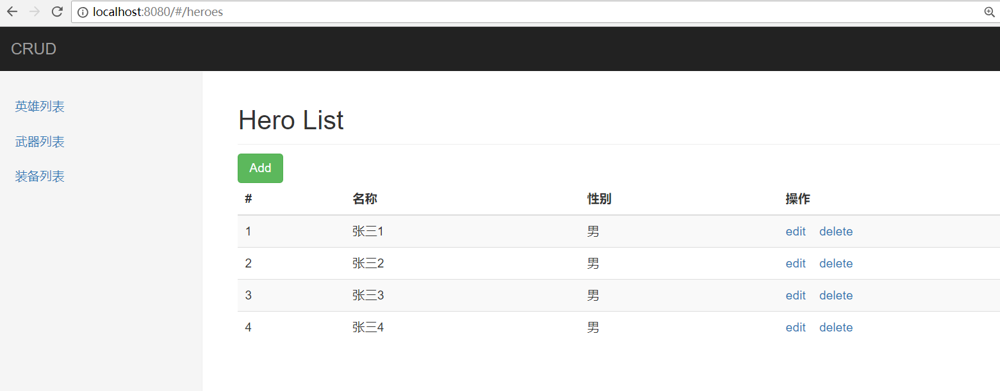

## 删除功能

> 点击英雄列表中每个英雄信息后面的删除按钮,可以删除当前英雄数据

### 步骤分析

1. 找到删除按钮, 绑定click事件
2. 将要删除的英雄的id传给删除方法
3. 在methods中实现删除方法
   1. 获取当前英雄的id
   2. 提示用户是否删除
   3. 如果是, 则调用axios.delete方法删除数据
      1. 删除成功, 重新渲染列表

### 代码演示

`AppList.vue`

```html
<template>
    <div>
        <h2 class="sub-header">Hero List</h2>
        <a class="btn btn-success" href="add.html">Add</a>
        <div class="table-responsive">
            <table class="table table-striped">

                <thead>
                    <tr>
                        <th>#</th>
                        <th>名称</th>
                        <th>性别</th>
                        <th>操作</th>
                    </tr>
                </thead>
                <tbody>
                    <tr :key="item.id" v-for="(item, index) in list">
                        <td>{{ index + 1 }}</td>
                        <td>{{ item.name }}</td>
                        <td>{{ item.gender }}</td>
                        <td>
                            <a href="edit.html">edit</a>
                            &nbsp;&nbsp;
                            <!-- <a href="javascript:window.confirm('Are you sure?')">delete</a>             -->
                            <a href="#" @click.prevent="handleDelete(item.id)">delete</a>

                        </td>
                    </tr>
                </tbody>
            </table>
        </div>
    </div>
</template>

<script>
    import axios from 'axios';

    export default {
        data(){
            return {
                list:[]
            }
        },
        created(){
            this.loadData();
        },
        methods:{
            loadData(){
                axios.get('http://localhost:3000/users')
                    .then((res)=>{
                    console.log(res);
                    const {status,data} = res;
                    if (status == 200) {
                        this.list = data;
                    }

                })
            },

            handleDelete(id) {
                // 删除提示
                if (!confirm('是否确认删除？')) {
                    return;
                }
                axios
                    .delete(`http://localhost:3000/users/${id}`)
                    .then((res) => {
                    if (res.status === 200) {
                        // 删除成功，重新渲染列表
                        this.loadData();
                    } else {
                        alert('删除失败');
                    }
                })
                    .catch((err) => {
                    console.log(err);
                });
            }
        }
    }
</script>
<style>

</style>

```

## 添加功能-页面

> 点击添加按钮 进入到添加的组件,输入新英雄信息,点击确定, 回到列表页渲染新数据

> 我们先让添加的页面显示出来

### 步骤分析

1. 新建add.vue组件
2. 将课程包中的add.html中添加的页面标签放置在add.vue中
3. 修改路由router.js
   1. 导入add.vue
   2. 注册add.vue
   3. 使用add.vue
4. 根据效果调整add.vue中的标签

### 代码演示

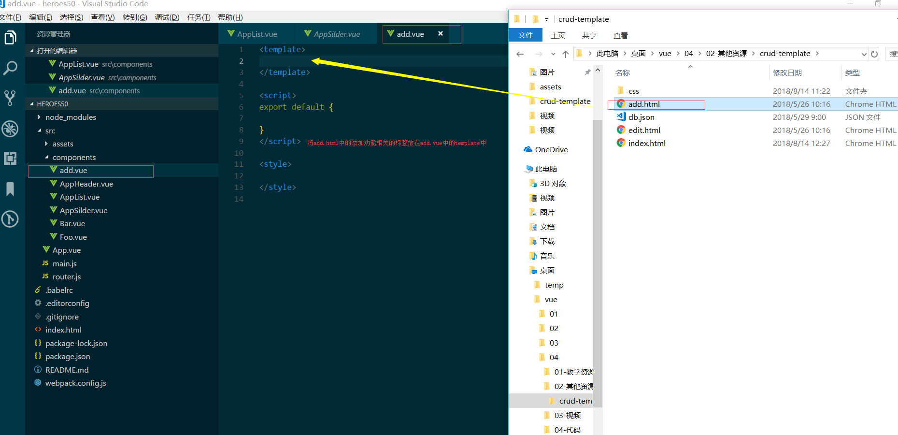

`add.vue`

```html
<template>
    <div>
        <h2 class="sub-header">Add Hero</h2>
        <form>
            <div class="form-group">
                <label for="exampleInputEmail1">Email address</label>
                <input type="email" class="form-control" id="exampleInputEmail1" placeholder="Email">
            </div>
            <div class="form-group">
                <label for="exampleInputPassword1">Password</label>
                <input type="password" class="form-control" id="exampleInputPassword1" placeholder="Password">
            </div>
            <div class="form-group">
                <label for="exampleInputFile">File input</label>
                <input type="file" id="exampleInputFile">
                <p class="help-block">Example block-level help text here.</p>
            </div>
            <div class="checkbox">
                <label>
                    <input type="checkbox"> Check me out
                </label>
            </div>
            <button type="submit" class="btn btn-success">Submit</button>
        </form>
    </div>
</template>

<script>
    export default {

    }
</script>

<style>

</style>

```

`router.js`

```js
import Vue from 'vue';

// 1. 导入路由
import VueRouter from 'vue-router';

// 导入组件
import AppList from './components/AppList.vue';
import Bar from './components/Bar.vue';
import Foo from './components/Foo.vue';
import Add from './components/add.vue';


// 注册插件
// https://cn.vuejs.org/v2/guide/plugins.html
Vue.use(VueRouter);

// 2. 创建路由对象，配置路由规则
const router = new VueRouter({
    routes: [
        // { name: 'home', path: '/', redirect: '/heroes' },
        { name: 'home', path: '/', redirect: { name: 'heroes' } },
        // 路由规则
        { name: 'heroes', path: '/heroes', component: AppList },
        { name: 'bar', path: '/bar', component: Bar },
        { name: 'foo', path: '/foo', component: Foo },
        { name: 'add', path: '/add', component: Add }

    ]
});

// 3 导出模块
export default router;
```

`AppList`

```html
<template>
    <div>
        <h2 class="sub-header">Hero List</h2>
        <!-- <a class="btn btn-success" href="add.html">Add</a> -->
        <!-- 注意动态绑定属性 : -->
        <router-link :to="{name:'add'}">添加</router-link>
        <div class="table-responsive">
            <!--省略-->
        </div>
    </div>
</template>

// 省略

```

`add.vue`

```html
<template>
    <div>
        <div>
            <h2 class="sub-header">Add Hero</h2>
            <form>
                <div class="form-group">
                    <label for="name">英雄名称</label>
                    <input type="text" class="form-control" id="name" placeholder="Name">
                </div>
                <div class="form-group">
                    <label for="sex">英雄性别</label>
                    <input type="text" class="form-control" id="sex" placeholder="Sex">
                </div>
                <button type="submit" class="btn btn-success">Submit</button>
            </form>
        </div>
    </div>
</template>
<!-- 省略-->
```

## 添加功能-功能实现

> 有了页面,接下来我们实现添加的功能

### 步骤分析:

1. 绑定文本框
2. 添加按钮注册事件
3. 发送请求

### 代码演示:

`add.vue` 

```html
<template>
    <div>  
        <h2 class="sub-header">Add Hero</h2>
        <form>
            <div class="form-group">
                <label for="name">英雄名称</label>
                <input v-model="formData.name" type="text" class="form-control" id="name" placeholder="Name">
            </div>
            <div class="form-group">
                <label for="sex">英雄性别</label>
                <input v-model="formData.gender" type="text" class="form-control" id="sex" placeholder="Sex">
            </div>
            <button @click.prevent="handleAdd" type="submit" class="btn btn-success">Submit</button>
        </form>
    </div>
</template>

<script>

    import axios from 'axios'
    export default {
        data() {
            return {
                // 绑定到表单元素
                formData: {
                    name: '',
                    gender: ''
                }
            }
        },
        methods:{
            handleAdd() {
                axios
                    .post('http://localhost:3000/users', this.formData)
                    .then((res) => {
                    const { status, data } = res;
                    if (status === 201) {
                        // 判断添加是否成功
                        // 添加成功，跳转到英雄列表
                        this.$router.push({ name: 'heroes' });
                    } else {
                        alert('添加失败');
                    }
                })
            }
        }
    }
</script>

<style>

</style>

```

## 编辑功能-页面

> 编辑的页面和添加的页面很像

### 步骤分析

1. 新建edit.vue组件
2. 将add.vue中的代码copy到edit.vue中进行修改
3. 修改路由router.js
   1. 导入edit.vue
   2. 注册edit.vue
   3. 使用edit.vue
4. 在AppList中设置router-link 动态参数

### 代码演示

`edit.vue`

```html
<template>
    <div>

        <h2 class="sub-header">Edit Hero</h2>
        <form>
            <div class="form-group">
                <label for="name">英雄名称</label>
                <input v-model="formData.name" type="text" class="form-control" id="name" placeholder="Name">
            </div>
            <div class="form-group">
                <label for="sex">英雄性别</label>
                <input v-model="formData.gender" type="text" class="form-control" id="sex" placeholder="Sex">
            </div>
            <button  type="submit" class="btn btn-success">Submit</button>
        </form>
    </div>
</template>

<script>

    import axios from 'axios'
    export default {
        data() {
            return {
                // 绑定到表单元素
                formData: {
                    name: '',
                    gender: ''
                }
            }
        },
        methods:{

        }
    }
</script>

<style>

</style>

```

`router.js` 

```js
import Vue from 'vue';

// 1. 导入路由
import VueRouter from 'vue-router';

// 导入组件
import AppList from './components/AppList.vue';
import Bar from './components/Bar.vue';
import Foo from './components/Foo.vue';
import Add from './components/add.vue';
import Edit from './components/edit.vue';

// 注册插件
// https://cn.vuejs.org/v2/guide/plugins.html
Vue.use(VueRouter);

// 2. 创建路由对象，配置路由规则
const router = new VueRouter({
    routes: [
        // { name: 'home', path: '/', redirect: '/heroes' },
        { name: 'home', path: '/', redirect: { name: 'heroes' } },
        // 路由规则
        { name: 'heroes', path: '/heroes', component: AppList },
        { name: 'bar', path: '/bar', component: Bar },
        { name: 'foo', path: '/foo', component: Foo },
        { name: 'add', path: '/add', component: Add },
        { name: 'edit', path: '/edit/:id', component: Edit }
    ]
});

// 3 导出模块
export default router;
```

`AppList`

```html
<!-- <a href="edit.html">edit</a> -->
<router-link :to="{name:'edit',params:{id:item.id}}">编辑</router-link>
```

## 编辑功能-功能实现

### 步骤分析:

1. 进入编辑页面，显示当前要编辑的英雄
   1. 获取url上的id，created()
   2. 发送请求获取数据
   3. 绑定文本框
2. 点击Submit按钮，实现更新功能

### 代码演示

`edit.vue` 

```html
<template>
    <div>
        <h2 class="sub-header">Edit Hero</h2>
        <form>
            <div class="form-group">
                <label for="name">英雄名称</label>
                <input v-model="formData.name" type="text" class="form-control" id="name" placeholder="Name">
            </div>
            <div class="form-group">
                <label for="sex">英雄性别</label>
                <input v-model="formData.gender" type="text" class="form-control" id="sex" placeholder="Sex">
            </div>
            <button @click.prevent="handleEdit" type="submit" class="btn btn-success">Submit</button>
        </form>
    </div>
</template>

<script>

    import axios from 'axios';

    // 1. 进入编辑页面，显示当前要编辑的英雄
    // 1.1 获取url上的id，created()
    // 1.2 发送请求获取数据
    // 1.3 绑定文本框

    // 2. 点击Submit按钮，实现更新功能

    export default {
        data() {
            return {
                formData: {
                    name: '',
                    gender: ''
                },
                // 获取url上的id，默认-1
                heroId: -1
            }
        },
        // 组件创建完毕
        created() {
            // 获取路由参数
            this.heroId = this.$route.params.id;
            console.log(this.heroId);

            // 调用 获取英雄对象的方法
            this.loadData();
        },
        methods: {
            // 根据id，获取英雄对象
            loadData() {
                axios
                    .get(`http://localhost:3000/users/${this.heroId}`)
                    .then((res) => {
                    if (res.status === 200) {
                        this.formData = res.data;
                    }
                });
            },
            handleEdit() {
                axios
                    .put(`http://localhost:3000/users/${this.heroId}`, this.formData)
                    .then((res) => {
                    if (res.status === 200) {
                        this.$router.push({ name: 'heroes' });
                    } else {
                        alert('修改失败');
                    }
                });
            }
        }
    };
</script>

<style>

</style>

```

## 当前选中导航的样式

> 选中某个导航时,其样式和其他的不同, 为active的样式
>
> [参考文档](https://router.vuejs.org/zh/api/#tag) 

`router.js` 

添加    linkActiveClass: 'active',全局配置

```js
// 省略
const router = new VueRouter({
    linkActiveClass: 'active',
    routes: [
        // { name: 'home', path: '/', redirect: '/heroes' },
        { name: 'home', path: '/', redirect: { name: 'heroes' } },
        // 路由规则
        { name: 'heroes', path: '/heroes', component: AppList },
        { name: 'bar', path: '/bar', component: Bar },
        { name: 'foo', path: '/foo', component: Foo },
        { name: 'add', path: '/add', component: Add },
        { name: 'edit', path: '/edit/:id', component: Edit }
    ]
});
// 省略
```

## 全局配置axios

> axios请求在多个组件中都要使用, 
>
> 所以, 可以考虑给Vue实例添加axios选项,
>
> 这样 所有的组件都可以使用

`main.js` 

```js
// 省略--

// 导入axios
import axios from 'axios';
// 配置所有Vue的实例都具有$http这个成员
Vue.prototype.$http = axios;

new Vue({
    el: '#app',
    render: h => h(App),
    // 配置实例选项 router 为你在上面 new 出来的 VueRouter 实例对象
    // router: appRouter
    router
});
```

> 将之前在组件中使用axios的位置改成

1. 去掉import axios from 'axios'
2. 将axios. 改成this.$http.

`add.vue` 

```js
<script>

    // import axios from 'axios'
    export default {
data() {
return {
// 绑定到表单元素
formData: {
    name: '',
        gender: ''
}
}
},
    methods:{
        handleAdd() {
            this.$http
                .post('http://localhost:3000/users', this.formData)
                .then((res) => {
                const { status, data } = res;
                if (status === 201) {
                    // 判断添加是否成功
                    // 添加成功，跳转到英雄列表
                    this.$router.push({ name: 'heroes' });
                } else {
                    alert('添加失败');
                }
            })
        }
    }
}
    </script>
```

## 配置baseUrl

> 请求的url中有一部分是一样的, 每次写很麻烦,
>
> 所以, 可以使用axios的API 配置baseURl

`main.js`

```js
// 省略--

// 导入axios
import axios from 'axios';
// 设置baseURL
axios.defaults.baseURL = 'http://localhost:3000/';

// 省略--
```

> 在发起this.$http请求的位置, 简化原来的url

`add.vue`

```js
<script>

    // import axios from 'axios'
    export default {
data() {
return {
// 绑定到表单元素
formData: {
    name: '',
        gender: ''
}
}
},
    methods:{
        handleAdd() {
            this.$http
                .post('users', this.formData)
                .then((res) => {
                const { status, data } = res;
                if (status === 201) {
                    // 判断添加是否成功
                    // 添加成功，跳转到英雄列表
                    this.$router.push({ name: 'heroes' });
                } else {
                    alert('添加失败');
                }
            })
        }
    }
}
    </script>
```

